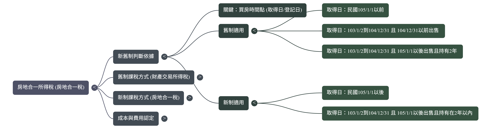
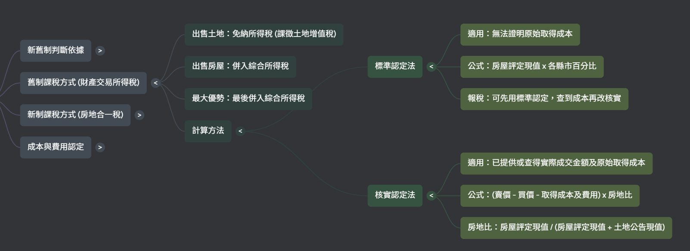
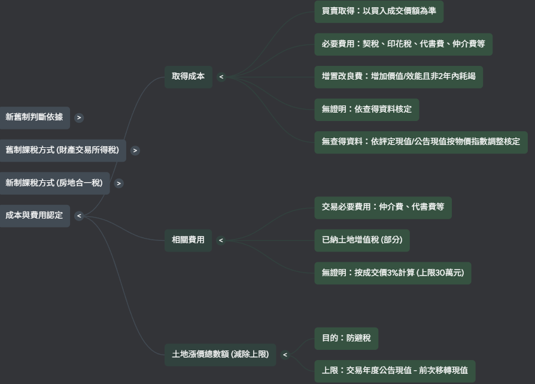
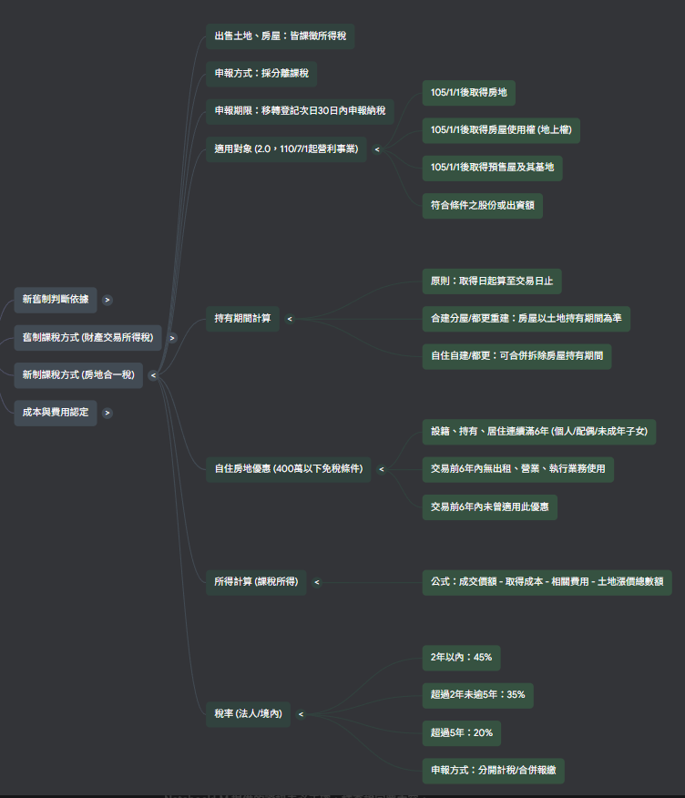

### **一、如何判斷適用新制或舊制？**

[財政部 - 房地合一稅2.0](https://www.mof.gov.tw/houseandland/multiplehtml/b059144336e54b11baba75a3468828ac)

房地交易適用制度，由「取得時間」與「出售時間」共同決定。

| 取得房地時間           | 出售房地時間        | 持有期間      | 適用制度                    |
| :--------------------- | :------------------ | :------------ | :-------------------------- |
| 不限                   | 104/12/31 (含) 以前 | 不限          | **舊制**              |
| 105/01/01 (含) 以後    | 105/01/01 (含) 以後 | 不限          | **新制 (房地合一稅)** |
| 103/01/02 至 104/12/31 | 105/01/01 (含) 以後 | 2年 (含) 以內 | **新制 (房地合一稅)** |
| 103/01/02 以前         | 105/01/01 (含) 以後 | 超過 2 年     | **舊制**              |

> 1、房地只要是在104年12月31日以前出售者，一律適用舊制。
> 2、房地在105年1月1日以後出售者：
> (1)105年1月1日以後取得者，一律適用新制。
> (2)105年1月1日以前取得，但持有期間在2年以內者，適用新制，如持有期間超過2年者，適用舊制。
> 3、舉例說明：
> (1)甲君在103年8月1日購入房地，於105年9月1日出售→持有期間超過2年，適用舊制。
> (2)乙君在103年8月1日購入房地，於105年3月1日出售→持有期間在2年以內，適用新制。
> (3)丙君在105年2月1日購入房地，於108年3月1日出售→適用新制。
> 4、前開出售日期，原則上以所有權移轉登記日為準。

---

### **二、舊制：財產交易所得稅總覽**

舊制的核心精神為「房地分離課稅」，僅針對房屋獲利課徵所得稅。

| 項目                          | 說明                                                           |
| :---------------------------- | :------------------------------------------------------------- |
| **課稅標的 (土地)**     | 課徵土地增值稅，其交易所得**免納所得稅**。               |
| **課稅標的 (房屋)**     | 僅就房屋的交易獲利課徵所得稅。                                 |
| **申報方式**            | 將房屋的交易所得，併入個人**年度綜合所得稅**中合併申報。 |
| **稅基計算 (核實認定)** | (房屋售價 - 房屋成本 - 相關費用)                               |
| **稅基計算 (標準認定)** | `房屋評定現值 × 各縣市核定百分比`                           |
| **稅率**                | 適用個人綜合所得稅的累進稅率 (**5% 至 40%**)。           |

---

### **三、新制：房地合一所得稅 2.0 總覽**

新制的核心精神為「房地合併、實價課稅」。

#### **(一) 核心原則**

| 項目               | 說明                                                                                                 |
| :----------------- | :--------------------------------------------------------------------------------------------------- |
| **課稅標的** | **房地合併課稅**，範圍包含105年1月1日後取得的房地、預售屋及其坐落基地、特定條件之股權交易。    |
| **申報方式** | 採**分離課稅**，不併入綜合所得稅，需在所有權移轉登記日的**次日起 30 日內**完成申報納稅。 |

#### **(二) 課稅所得額（稅基）計算**

> **課稅所得額 = (成交價額 - 原始取得成本 - 相關費用) - 土地漲價總數額**

**可減除項目表**

| 類別           | 項目             | 說明                                                                 |
| :------------- | :--------------- | :------------------------------------------------------------------- |
| **成本** | 原始取得成本     | 買入的成交價。                                                       |
|                | 取得時的必要費用 | 包含契稅、印花稅、代書費、仲介費、公證費等。                         |
|                | 增置改良費用     | 能增加房屋價值或效能，且非2年內能耗竭的修繕支出。                    |
|                | 繼承/受贈取得    | 以繼承或受贈時的房屋評定現值及公告土地現值，按CPI調整後認定。        |
| **費用** | 移轉時的必要費用 | 出售時支付的仲介費、廣告費、清潔費、搬運費等。                       |
|                | 費用認定 (核實)  | 提供單據，依實際支出金額減除。                                       |
|                | 費用認定 (設算)  | 無單據時，可按**成交價額 3%** 計算，**上限為 30 萬元**。 |

**不可減除項目表**

| 項目                   | 說明                               |
| :--------------------- | :--------------------------------- |
| **持有期間稅費** | 房屋稅、地價稅、管理費。           |
| **持有期間利息** | 取得所有權後向金融機構貸款的利息。 |

#### **(三) 稅率：依持有期間決定**

| 持有期間           | 個人稅率 (境內居住者) | 營利事業稅率 (總機構在境內) |
| :----------------- | :-------------------- | :-------------------------- |
| 2 年 (含) 以內     | **45%**         | **45%**               |
| 超過 2 年 至 5 年  | **35%**         | **35%**               |
| 超過 5 年 至 10 年 | **20%**         | **20%**               |
| 超過 10 年         | **15%**         | **20%**               |

#### **(四) 稅務優惠與減免**

| 優惠類型               | 適用條件                                                                                                                                                                                                                                                                                                        | 優惠內容                                                                                         |
| :--------------------- | :-------------------------------------------------------------------------------------------------------------------------------------------------------------------------------------------------------------------------------------------------------------------------------------------------------------- | :----------------------------------------------------------------------------------------------- |
| **自住房地優惠** | 需同時滿足三項條件： 1.個人或其關係人設籍並連續居住滿6年。  2.交易前6年內無出租或營業使用。  3.交易前6年內未曾使用過此優惠。 故出售房地時，該地址應有「本人」、「配偶」或「未成年子女」設戶籍，始符合前開要件，如僅有「成年子女」設戶籍，不符合前開要件，尚無自住房屋、土地優惠規定之適用。 | 課稅所得在**400萬元以下免稅**；超過400萬的部分，按**10%**優惠稅率課徵。                    |
| **重購退稅優惠** | 出售舊的自住房地後，在**2年內**重購新的自住房地（先賣後買或先買後賣皆可）。                                                                                                                                                                                                                               | **換大屋** (新屋價 > 舊屋價) 可全額退稅；**換小屋** (新屋價 < 舊屋價) 則按比例退稅。 |

