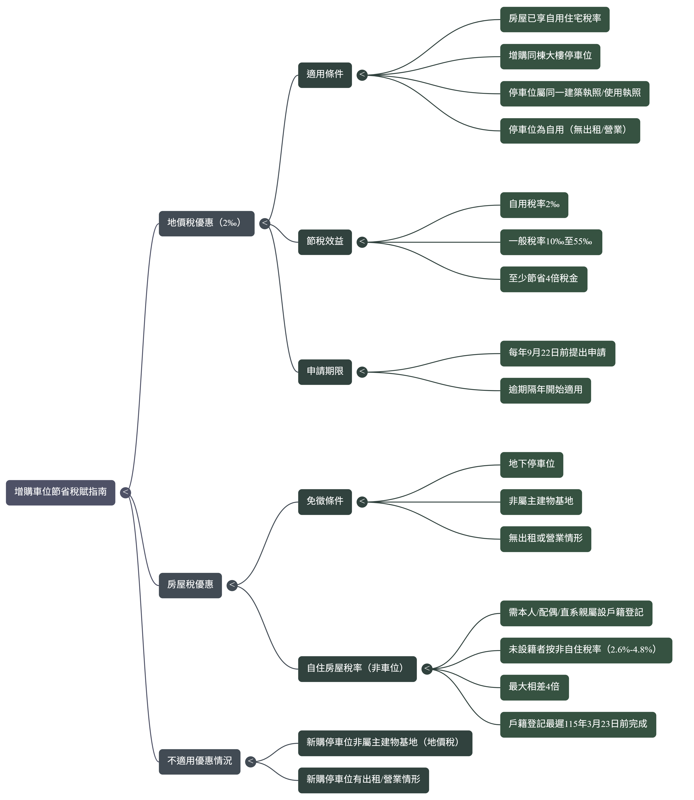

聰明購車位，稅金省很大！你不可不知的節稅秘訣

隨著家庭成員增加或工作通勤需求，你是不是也考慮為家裡添購第二個車位呢？

買車位不僅是為了方便，買對了還能幫你省下一大筆稅金！

今天就來分享一個超實用的地產小知識：如何透過增購車位，讓你的地價稅和房屋稅都更優惠。

### 節稅重點速覽

| 項目                 | 重點內容                                                                                                                                                              | 備註                                               |
| :------------------- | :-------------------------------------------------------------------------------------------------------------------------------------------------------------------- | :------------------------------------------------- |
| **核心觀念**   | 將增購的停車位，一併申請適用「自用住宅用地」的優惠稅率。                                                                                                              | 這是整個節稅操作的基礎。                           |
| **適用條件**   | 1. 增購的車位與原房屋，屬於**同一張**建築執照或使用執照。` `2. 車位為**自用**，沒有出租或供營業使用。                                                | 必須同時滿足這兩個條件。                           |
| **地價稅優惠** | •**自用住宅稅率**：$2‰$ (千分之二)` `• **一般用地稅率**：$10‰$ (千分之十) 起跳                                                               | 稅率至少相差**4** 倍。                       |
| **房屋稅優惠** | •**符合條件的地下停車位**：可申請**免徵**房屋稅。` `• **非自住房屋稅率**：$2\% \sim 4.8\%$                                                 | 若未辦理戶籍登記被視為非自住，稅負差距也很大。     |
| **申請期限**   | •**地價稅**：想在**當年度**適用，需於 **9月22日** 前提出申請。` `• **房屋稅**：需先完成戶籍登記，並在**隔年3月23日**前提出申請。 | 錯過期限，優惠就只能從下一個年度才開始計算。       |
| **關鍵行動**   | **主動**向地方稅務局提出申請。                                                                                                                                  | 稅務機關不會自動給予優惠，必須由所有權人自行申請。 |

### 核心觀念：讓新車位適用「自用住宅優惠稅率」

許多人可能不知道，如果你名下的房屋已經在享受「自用住宅用地」的優惠稅率，那麼當你增購同一棟大樓的停車位時，這個新車位也有機會適用同樣的優惠。

關鍵在於，只要新買的車位符合以下條件，就能提出申請：

* 與你原有的房屋屬於同一建築執照或使用執照。
* 車位是自己使用，沒有出租或營業。

### 到底能省多少？稅率差異大公開

為什麼要特別申請呢？因為稅率真的差很多！

* **地價稅**：
  * 自用住宅用地稅率：$2‰$ (千分之二)。
  * 一般用地稅率：$10‰$ 起跳 (千分之十)。
  * 兩者稅率至少相差 4 倍。
* **房屋稅**：
  * 符合條件的地下停車位，甚至可以申請免徵房屋稅。
  * 如果房屋未辦理戶籍登記，會被視為「非自住」，稅率將是 $2.6\%$ - $4.8\%$，與自住稅率相比，差距也可能高達 4 倍。

### 實際案例分享

文章中提到一個新竹張先生的例子：他幾年前買了房，並已申請適用自用住宅稅率。最近因通勤需要，向鄰居買了同棟大樓的第二個停車位。

由於新車位與原有房屋在同一個建照下，且是自用，他便成功申請將車位的土地持分比照自用住宅用地稅率課稅。此外，因為車位在地下室，也同時申請了免徵房屋稅。一來一往，省下的稅金相當可觀。

### 重點提醒：申請時間是關鍵

想要享受稅率優惠，千萬別忘了主動提出申請，而且要注意申請期限：

* **地價稅**：想在當年度就適用優惠稅率，必須在 **9 月 22 日前**向稅務局提出申請。如果錯過了，就只能等明年才能開始適用了。
* **房屋稅**：要享有自住優惠稅率，本人、配偶或直系親屬的戶籍必須登記完成。最晚應在**隔年 3 月 23 日前**辦妥戶籍並提出申請。

買車位是筆不小的開銷，但只要多留意這些稅務細節，就能為自己省下不必要的支出。希望今天的分享對你有幫助！

