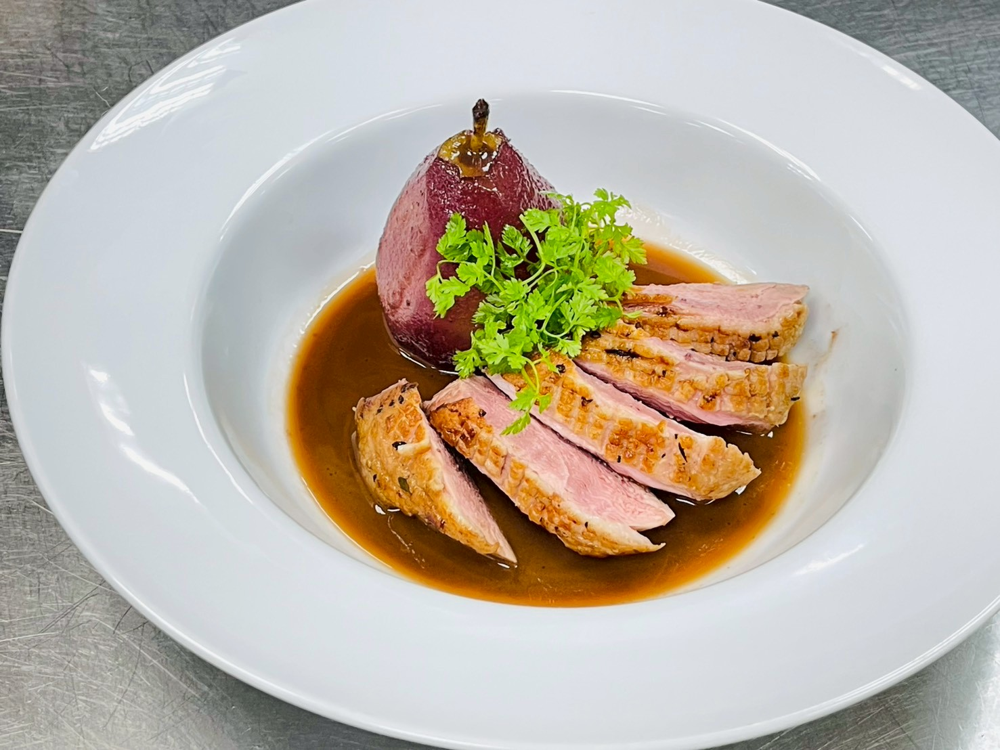
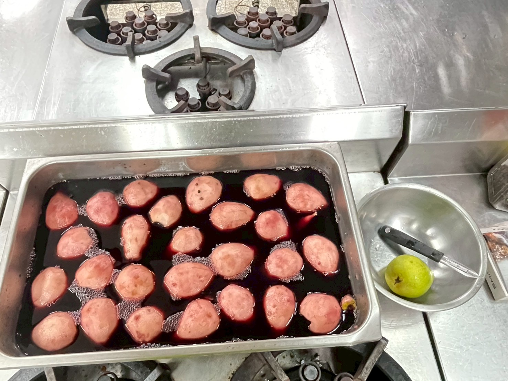
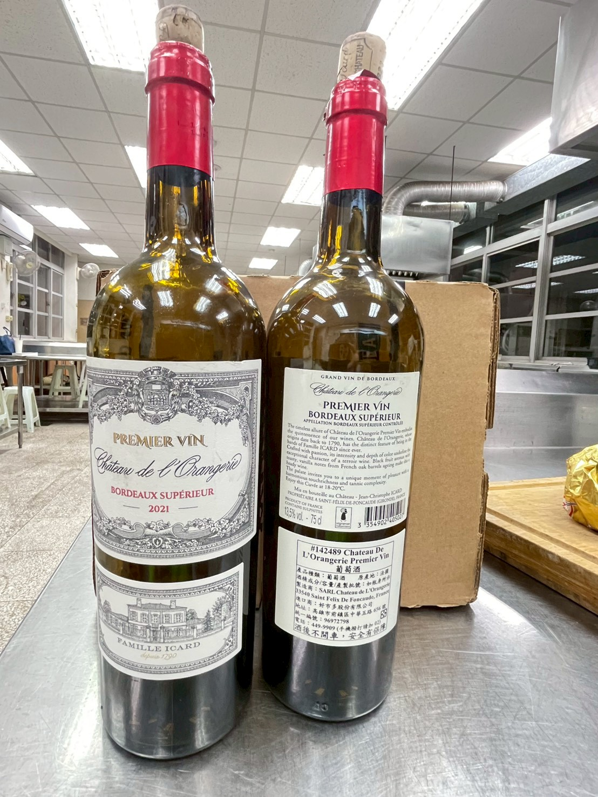
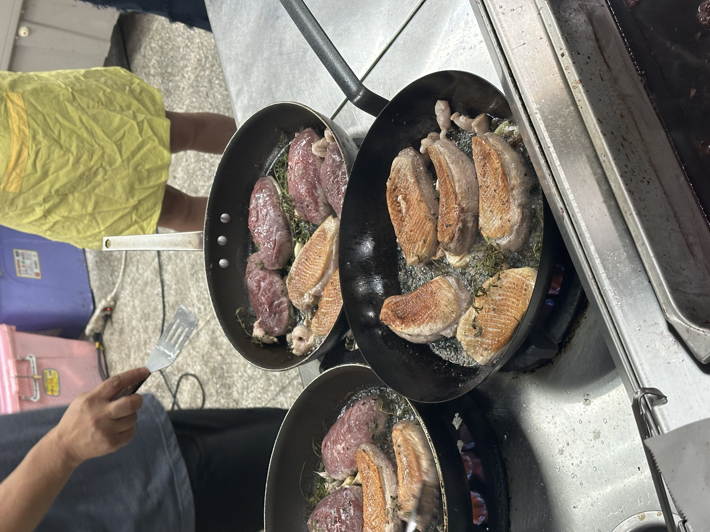
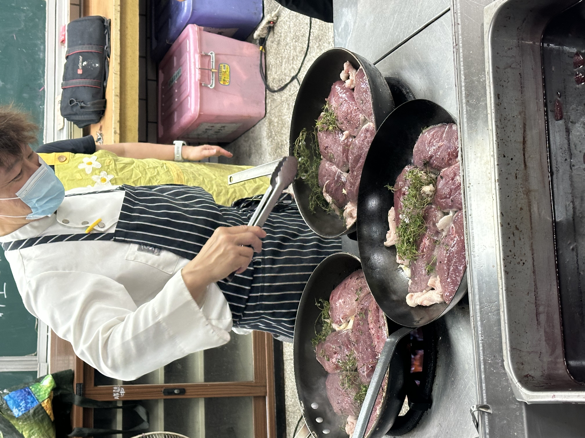
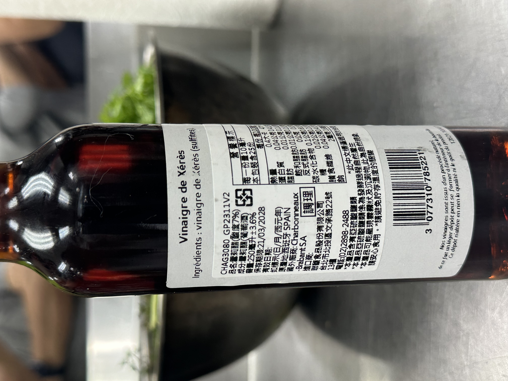
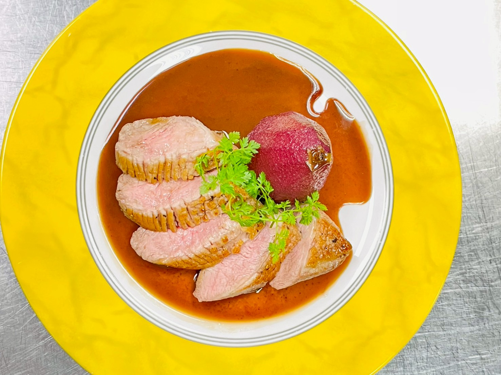

---
title: "嫩煎鴨胸附水波煮紅酒洋梨 (Seared Duck Breast with Red Wine Poached Pear)"
date: 2025-11-07T22:01:14+08:00
description: "融合法國傳統香煎鴨胸與紅酒慢煮洋梨的經典料理，以酸甜醬汁平衡濃郁脂香的歐陸精緻風味。"
type: "lifestyle"
image: "成品demo.jpg"
categories:
  - "歐式料理"
  - "法式料理"
  - "【食譜筆記】"
tags:
  - "主菜"
  - "鴨胸"
  - "紅酒洋梨"
  - "法式料理"
---

## 🍴 嫩煎鴨胸與紅酒水波洋梨

這道料理融合了法國傳統烹調鴨肉的習法與以葡萄酒慢煮水果的經典甜品手法，展現歐陸餐桌上精緻優雅的風味。

在法國，鴨胸（Magret de Canard）長期被視為與牛排同等重要的餐桌主角。尤其是在鵝鴨飼養盛行的西南部，如 Gascogne、Landes、Périgord 等地，人們普遍以煎製方式保留其柔嫩肉質與濃厚脂香，再搭配淡雅酸甜的醬汁，強化層次。

另一方面，紅酒燉煮水果則可追溯至法國**勃根地（Bourgogne）與羅亞爾河谷（Loire）**等地區。當地葡萄產量豐富，人們會利用季節性水果（尤其是梨子）加入香料與紅酒慢煮，成為餐後甜點或高級宴席的配菜，其中 Poire au Vin（紅酒煮梨） 更是經典代表。

後來，廚師將紅酒煮梨的優雅酸甜與煎鴨胸的濃郁油脂結合，形成甜鹹對比、香氣富含層次的主菜。梨子的果香與紅酒的單寧能柔化鴨肉的厚重口感，使整體味道達到平衡；而鴨胸的油脂則讓水果與酒香更顯圓潤，兩者相互襯托，成為高級餐廳中廣受喜愛的法式經典。

### 📌 食材準備清單 (Mise en place)

| 區塊 | 食材 | 份量 | 備註 |
| :--- | :--- | :--- | :--- |
| **Main Dish** (鴨胸主體) | 櫻桃鴨胸 | 3 塊 | 需修整、刻花 |
| | 帶皮大蒜 | 3 粒 | 拍碎用 |
| | 百里香 | 1 小把 | |
| | 鹽與胡椒 | 少許 | 調味用 |
| **Poached Pear** (水波洋梨) | 西洋梨 | 12 個 | 去皮去核 |
| | 紅酒 | 750 ml | |
| | 胡椒粒 | 20 粒 | |
| **Red Wine Caramel Sauce** (紅酒焦糖醬) | 糖 | 50 g | 製作焦糖基底 |
| | 雪莉醋 (或紅酒醋) | 50 ml | 中止焦糖化 |
| | 牛褐高湯 | 250 ml | |
| | 鴨胸筋肉 | 適量 | 修整鴨胸時取下 |
| | 濃縮紅酒汁 (B) | 450 ml | 從煮梨的紅酒濃縮而來 |
| | 無鹽奶油 | 60 g | 冷藏狀態，乳化用 |
| | 鹽及胡椒 | 少許 | 最終調味 |
| **Garnish** (裝飾) | 山蘿蔔葉 (Chervil) | 1 小把 | |

---

### 📝 主廚技術重點 (Chef's Critical Notes)

在開始烹飪前，請先掌握以下決定成敗的關鍵細節：

* **鴨胸煎製**（**冷鍋冷油**開始煎）：才能充分逼出鴨皮下的厚重油脂，達到皮脆肉嫩。
* **熟度控制**（中心溫度 **55–60°C**）：約五分熟。鴨胸全熟會過於乾柴，此溫度區間口感最佳。
* **淋油熟成**：煎製時不斷用熱油澆淋肉面，此利用熱油使上方肉面均勻受熱，無需過度翻面。
* **焦糖製作**：加熱二砂時 **不要攪拌**。攪拌容易使糖結晶反砂，應讓其自然融化至琥珀色。
* **醬汁乳化**：加入奶油前務必 **離火降溫**。溫度過高會導致油水分離 (Split)，無法形成絲滑光澤。

---

### 📝 烹飪步驟

#### 【一、食材前處理】

1. **鴨胸前處理**：
    * 修除多餘油脂與筋膜。
    * 皮面劃格狀刀口 (不切到肉)，刀口有助於油脂釋出。
    * 吸乾水分，冷藏備用。
    
2. **洋梨前處理**：
    * 西洋梨去皮、挖核 (不穿透)。
    * 用紅酒 + 胡椒粒浸泡 30 分鐘。
    

#### 【二、製作水波梨】

1. 紅酒鍋內放入梨，蓋上涂奶油的烘焙紙 (Cartouche)。
2. 水滾後轉小火煮 20 分。取出瀝乾。
    * *熟度標準：小刀可刺穿但不軟爛。*
3. 剩餘紅酒濃縮至稠狀，記為**【B紅酒液】**。
    

#### 【三、熬製鴨汁基底】

1. 熱鍋炒香鴨翅、筋肉、奶油。
2. 加入蒜頭、百里香炒香。
3. 倒入牛高湯持續熬煮濃縮。
4. 過濾去渣與浮沫，記為**【A鴨汁】**。此為醬汁的風味靈魂。

#### 【四、香煎鴨胸】

1. 鴨胸擦乾，撒鹽胡椒調味。
2. **冷鍋**放入鴨胸 (皮面朝下)，中火慢煎出油。
3. 加入拍碎蒜頭、百里香賦味。
4. **淋油熟成**至中心溫度達 55-60°C。
5. 起鍋**靜置 15 分鐘**。靜置是讓肉汁回流、肉質粉嫩的關鍵。
    
    

#### 【五、製作紅酒焦糖醬】

1. 糖加熱至焦化 (琥珀色) → 加入雪莉醋中止。
    
2. 加入【A鴨汁】+【B紅酒液】(需過濾) 濃縮。
3. 撇除浮沫，加鹽調味。
4. **離火降溫**，拌入冷藏奶油塊快速乳化。完成的醬汁應呈現濃稠且帶有光澤感。

#### 【六、擺盤】

1. 將靜置好的鴨胸切片。
2. 擺上紅酒燉梨。
3. 淋上紅酒焦糖醬與裝飾香草。
    
