## 手工番茄義大利麵附牛肉球

Homemade pasta with beef meatballs in tomato sauce

手工義大利麵是義式料理裡最能感受「手感」的一道功夫菜。以 00 號麵粉搭配大量雞蛋揉製的麵團，口感比乾燥麵條更為彈韌滑順；杜蘭小麥粉（Semolina）的加入讓麵皮帶有微微的粗獷顆粒感，不易沾黏、更耐醬汁。番茄醬汁以罐頭番茄碎慢燉，白酒增香、新鮮羅勒葉收尾，呈現南義式的鮮亮酸甜；牛豬混合的肉球裹上麵包粉與巴馬森起司，表面煎至微酥，再入番茄醬慢燉吸飽湯汁，是整道菜最撫慰人心的部分。

這道菜源自義大利南部坎帕尼亞一帶的家常飲食傳統，特別是拿坡里（Napoli）家族長桌上的週日菜色。義式肉球（Polpette）講究大小一致、牛豬混絞保持軟嫩，與豐厚番茄醬汁同燉，麵條選以新鮮手桿麵（Fresh Pasta）為主，厚度與寬度依個人喜好調整，從細緻的 Tagliatelle 到寬厚的 Pappardelle 都是經典選擇。

---

### 📌 食材準備清單 (Mise en place)

#### Pasta dough

| 食材                            | 份量  |
| :------------------------------ | :---- |
| 義大利麵粉 Type "00" 或中筋麵粉 | 400 g |
| 雞蛋                            | 6 個  |
| 杜蘭小麥粉（Semolina）          | 200 g |
| 鹽                              | 3 g   |
| 橄欖油                          | 50 ml |

#### For the tomato sauce

| 食材                | 份量   |
| :------------------ | :----- |
| 橄欖油              | 50 ml  |
| 蒜                  | 5 粒   |
| 洋蔥碎              | 1/2 個 |
| 白酒                | 150 ml |
| 罐頭番茄碎          | 600 g  |
| 番茄糊              | 40 g   |
| 新鮮羅勒葉（Basil） | 10 片  |
| 去籽黑橄欖          | 30 粒  |
| 鹽及胡椒            | 適量   |

#### For the beef meatballs

| 食材                | 份量   |
| :------------------ | :----- |
| 牛絞肉              | 350 g  |
| 豬絞肉              | 150 g  |
| 大蒜碎              | 40 g   |
| 洋蔥碎              | 1/2 個 |
| 新鮮巴西里葉碎      | 1 小把 |
| 俄力岡葉（Oregano） | 1 小把 |
| 麵包粉              | 50 g   |
| 雞蛋                | 1 個   |
| 巴馬森起司粉        | 50 g   |
| 鹽及胡椒            | 適量   |

---

### 📝 主廚技術重點 (Chef's Critical Notes)

* **麵團必須充分醒麵**：揉好的麵團表面用保鮮膜包好冷藏靜置至少 30 分鐘，讓麵筋鬆弛，才能輕鬆桿薄不回縮。
* **巴西里葉只能用刀切**：手持料理機的高速轉動會使巴西里葉出水、變黑，必須用刀子細細切碎，保留香氣與乾爽度。
* **肉球黏性靠麵包粉與蛋液**：麵包粉吸收肉汁、雞蛋提供結著力，兩者缺一肉球容易散開。攪拌要往同一方向，讓蛋白質充分拉伸。
* **捏出大小相同的丸子**：每顆重量一致（約 30–40 g），確保煎製與燉煮熟度均勻。
* **白酒的加入時機**：炒香洋蔥蒜後先加白酒，等酒精揮發再加番茄，酒精若留在醬汁裡會帶酸澀感。

---

### 📝 烹飪步驟

#### 【一、製作麵團（Pasta dough）】

1. **準備食材**：備好麵粉、Semolina、雞蛋、鹽與橄欖油，分類放置工作台上。

   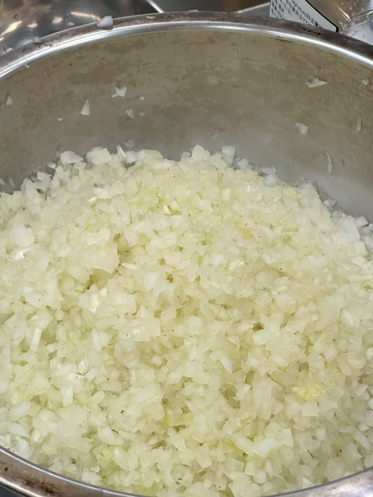
2. **揉製麵團**：將兩種麵粉混合，中央挖洞，打入雞蛋、加鹽與橄欖油，從中心開始慢慢將麵粉拌入，持續揉壓至麵團表面光滑不黏手（約 10 分鐘）。

   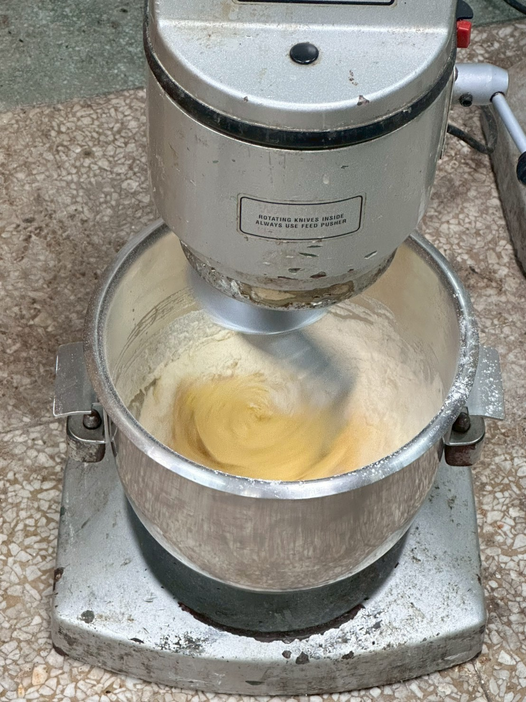
3. **醒麵**：麵團用保鮮膜包好分裝，放入冰箱冷藏靜置至少 30 分鐘。

   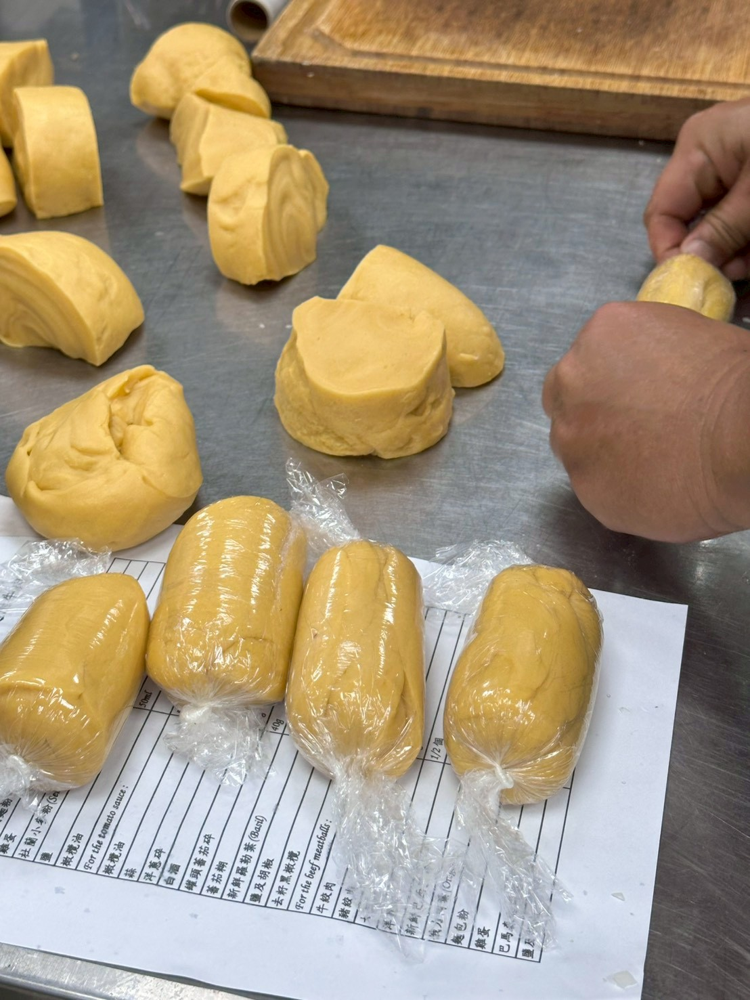
4. **切割麵糰**：取出後切成適合操作的小份量，其餘繼續以保鮮膜覆蓋，避免乾燥。

   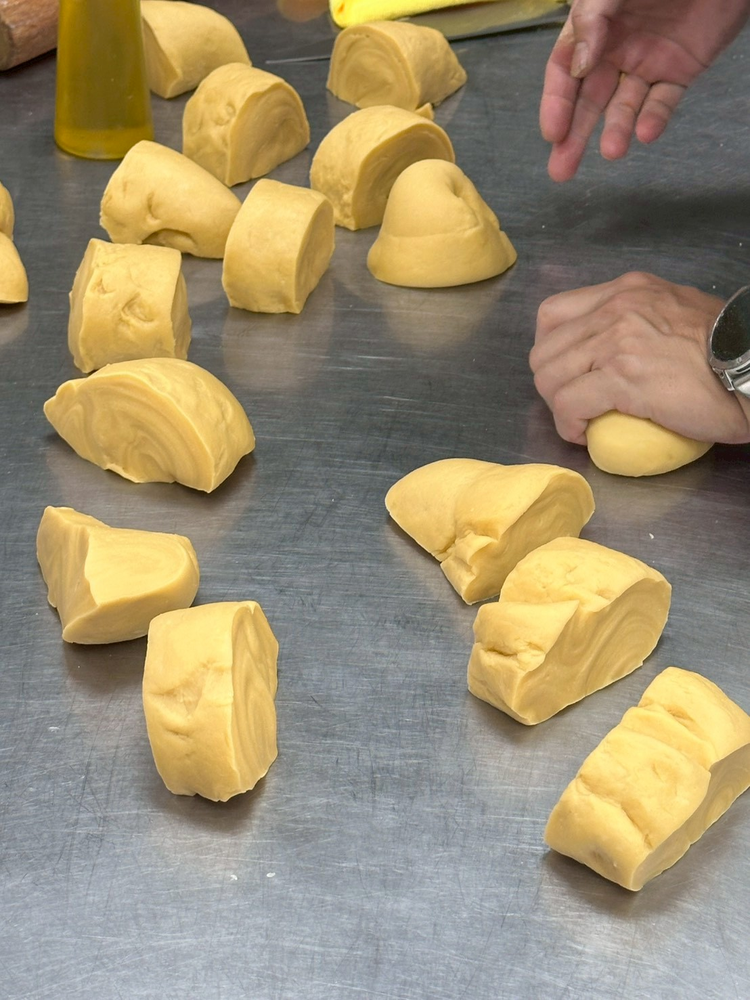
5. **桿製麵皮**：撒上少許 Semolina 防沾，以桿麵棍或壓麵機逐步桿薄，桿至所需厚度（約 2–3 mm）。

   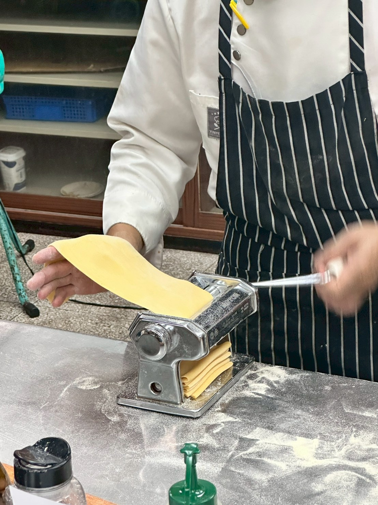
6. **切條**：麵皮桿好後撒粉，依喜好切成 Tagliatelle 或 Pappardelle 寬度，鬆散放置備用。

   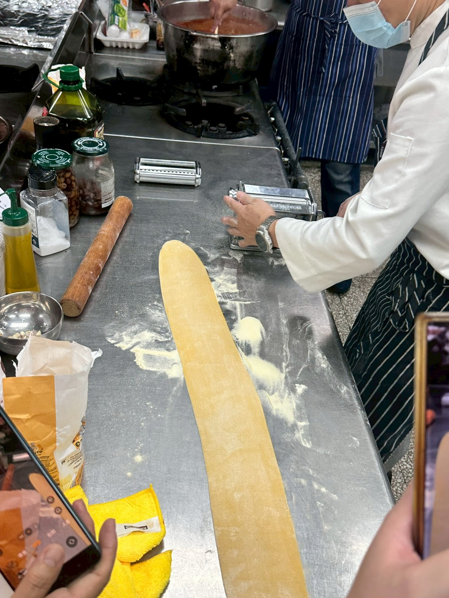

---

#### 【二、製作牛肉球（Beef meatballs）】

1. **切碎香草**：巴西里葉**務必以刀子切碎**，不可使用料理機，避免出水變黑；大蒜與洋蔥亦切細碎備用。

   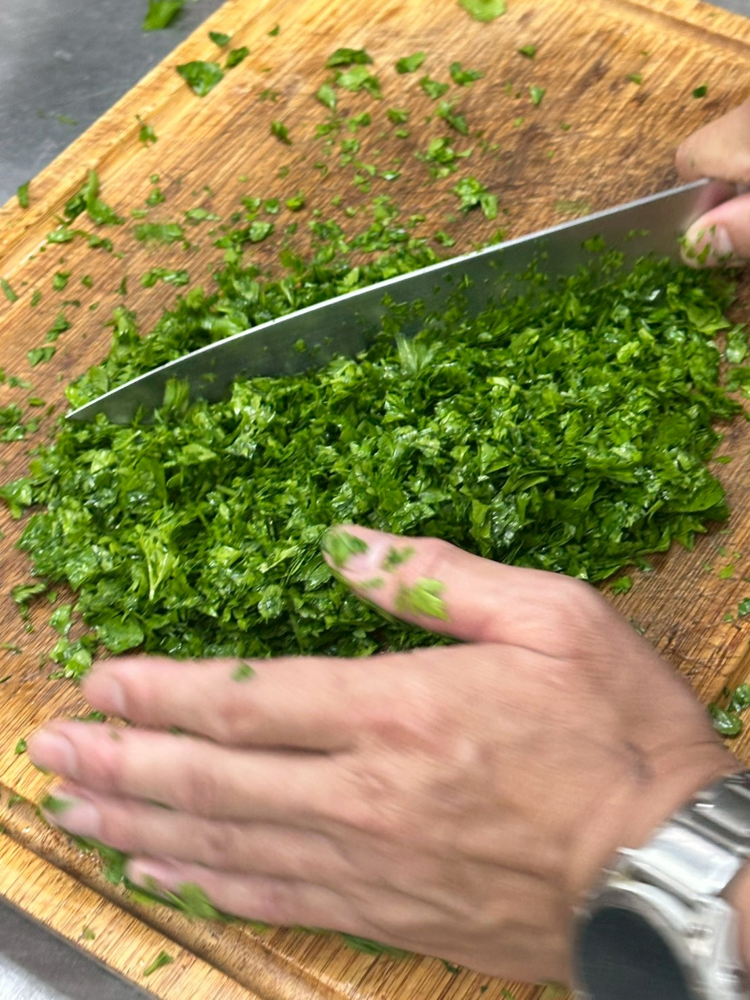
2. **備好俄力岡葉**：俄力岡葉（Oregano）帶有南義風格的粗獷香氣，是肉球配方中不可缺少的靈魂。

   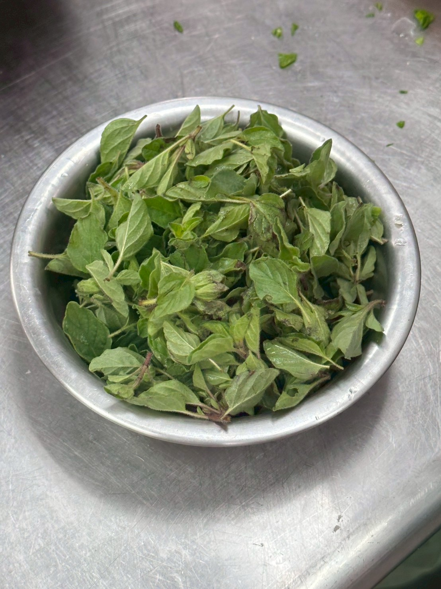
3. **混合配料**：將大蒜碎、洋蔥碎、巴西里葉碎、俄力岡葉與巴馬森起司粉加入牛豬混合絞肉，充分混勻。

   .jpg)
4. **加入黏著劑**：放入麵包粉與全蛋，往同一方向持續攪拌，讓肉餡充分拉伸結著，加鹽及胡椒調味。

   .jpg)
5. **捏製丸子**：雙手沾濕，取等量肉餡（約 30–40 g）滾圓，確保每顆大小一致，排列備用。

   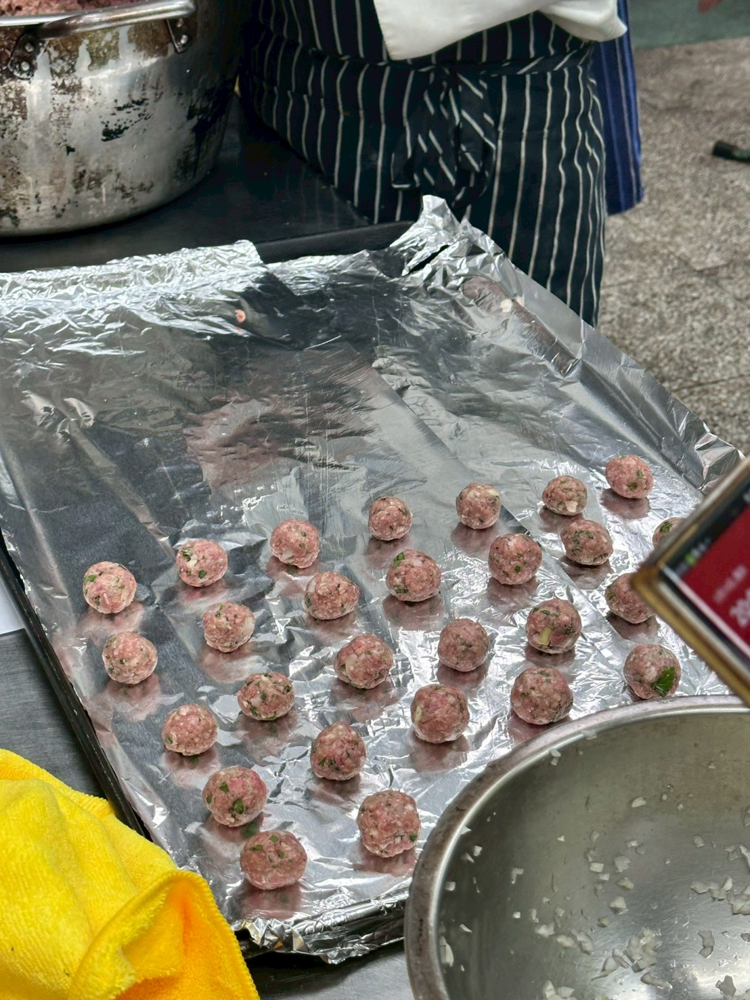
6. **煎製上色**：熱鍋中加入橄欖油，大火將肉球各面煎至金黃微酥後先取出，完整的焦色是燉煮時風味的基底。

---

#### 【三、製作番茄醬汁（Tomato sauce）】

1. **炒香蒜與洋蔥**：鍋中加橄欖油，以中小火慢炒蒜碎與洋蔥碎至透明甘甜、不上色。

   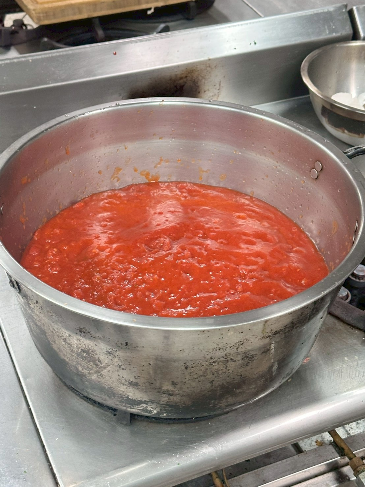
2. **加入白酒**：倒入白酒，大火燒煮讓酒精完全揮發，醬汁略為收乾。
3. **加入番茄**：放入罐頭番茄碎與番茄糊，加鹽及胡椒，轉中小火慢燉約 20 分鐘，讓醬汁濃縮、酸味轉甘甜。
4. **放入羅勒葉**：醬汁快完成前放入新鮮羅勒葉，同煮約 5 分鐘，充分釋放清香。

   .jpg)
5. **加入肉球慢燉**：將煎好的肉球輕放入番茄醬汁中，加蓋以小火再燉煮 15–20 分鐘，讓肉球充分吸飽醬汁風味。

   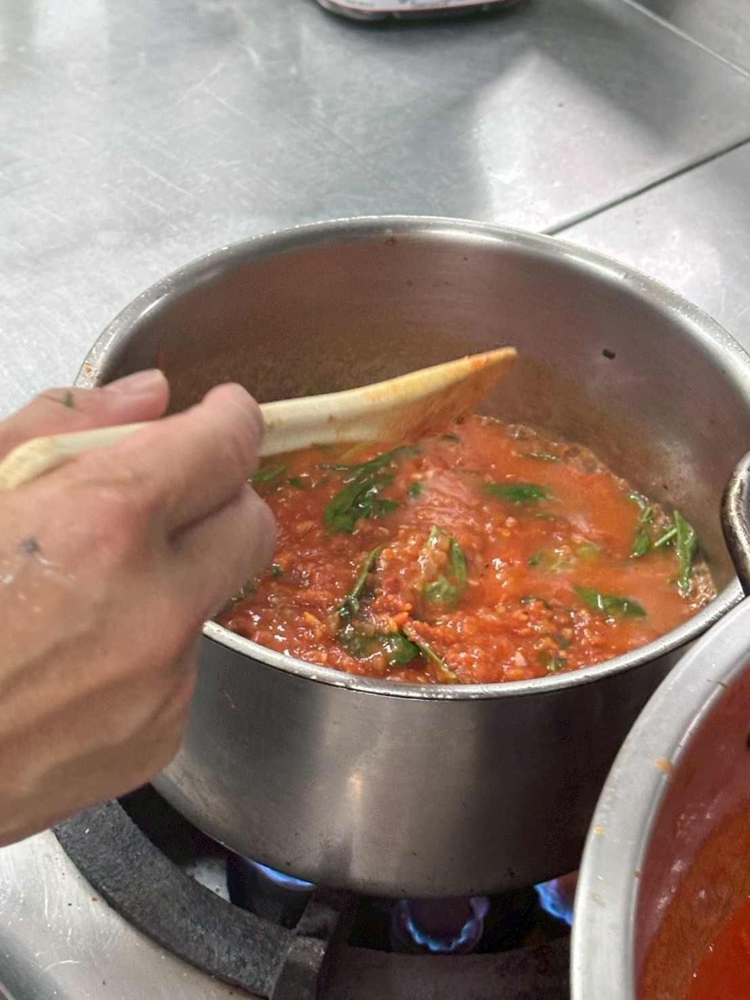
6. **最後放入黑橄欖**：去籽黑橄欖在起鍋前 5 分鐘加入即可，過度加熱會失去彈性與鮮味。

---

#### 【四、煮麵與擺盤（Plating）】

1. 煮一大鍋沸騰鹽水（每公升約 10 g 鹽），放入新鮮手桿麵，視厚度約煮 2–4 分鐘至彈牙熟透。
2. 撈起麵條，稍微瀝乾後直接拌入番茄醬汁。
3. 盤中先放麵，擺上 2–3 顆肉球，淋上額外醬汁，可刨上新鮮巴馬森起司完成擺盤。

---

### 主廚筆記 (Chef's Notes)

* **00 號麵粉 vs 中筋麵粉**：00 號麵粉研磨更細、蛋白質含量略低，揉出的麵皮更柔滑；中筋麵粉也可替代，口感略為紮實，仍有不錯的結果。
* **Semolina 的作用**：杜蘭小麥粉蛋白質高、顆粒粗，加入配方讓麵皮更耐嚼，也可單獨撒在麵皮表面防沾。
* **肉球比例**：牛豬 7:3 的比例是經典義式配方——牛肉提供風味與嚼感，豬肉提供油脂使肉球保持柔嫩多汁，不易過乾。
* **罐頭番茄的選擇**：義大利 San Marzano 品種的番茄罐頭酸甜平衡最佳；若使用一般整粒番茄罐頭，入鍋後用木匙稍加壓碎即可。
* **醬汁的靈活性**：此番茄醬汁可單獨保存冷藏 3 天、冷凍 1 個月，不加肉球即是萬用義式番茄醬底，搭配任何麵型皆宜。
