## Crêpes with fresh fruit, pastry cream, and orange sabayon

這道經典的法式甜點結合了細緻的薄餅、濃郁的卡士達醬以及充滿酒香與橙香味的沙巴雍醬汁（Sabayon）。

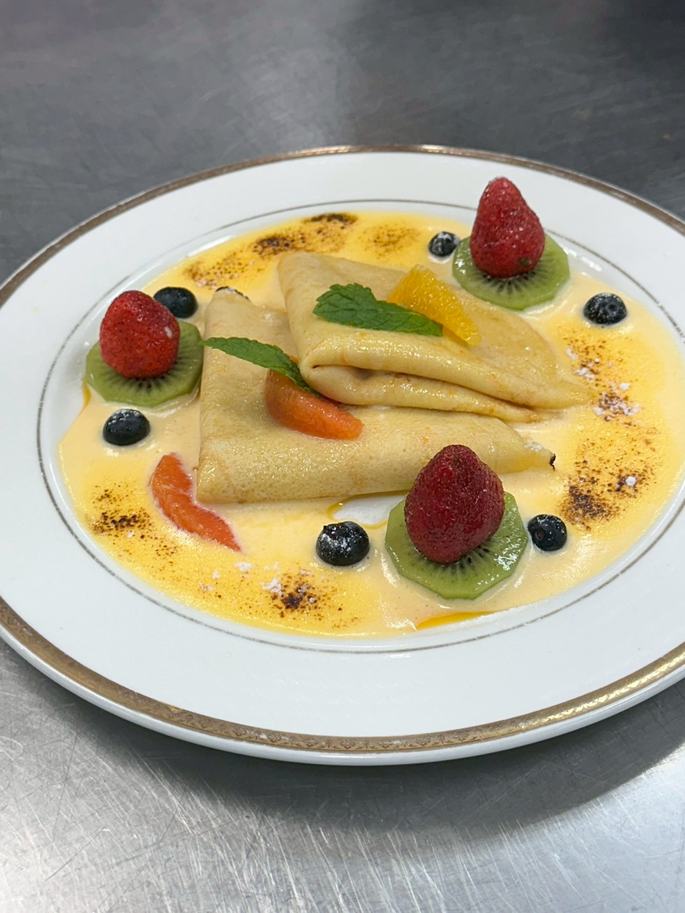

---

## 重點筆記

- **核心技術**：麵糊靜置（冷藏 30 分鐘）、醬汁乳化、雙重過篩。

## 食材清單

### 1. 薄餅麵糊 (Crêpes batter)

| 食材品名 | 單位及數量 |
| :--- | :--- |
| 法國 T55 麵粉 | 130g |
| 鹽 | 3g |
| 糖 | 10g |
| 雞蛋 | 2個 |
| 甜橙皮屑 | 1個 |
| 牛奶 | 250ml |
| 融化的無鹽奶油 | 50g |
| 澄清奶油 | 適量 (煎薄餅用) |

### 2. 卡士達內餡 (For the pastry cream)

| 食材品名 | 單位及數量 |
| :--- | :--- |
| 牛奶 | 250ml |
| 香草豆莢或香草精 | 1條 |
| 蛋黃 | 2個 |
| 糖 | 60g |
| 麵粉 | 40g |

將牛奶倒入鍋中，剖開香草豆莢刮入種子，以小火加熱至微滾後離火。
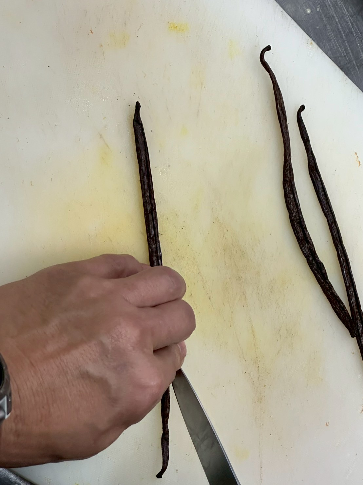

將蛋黃與砂糖混合，用打蛋器快速攪拌至顏色變淺。
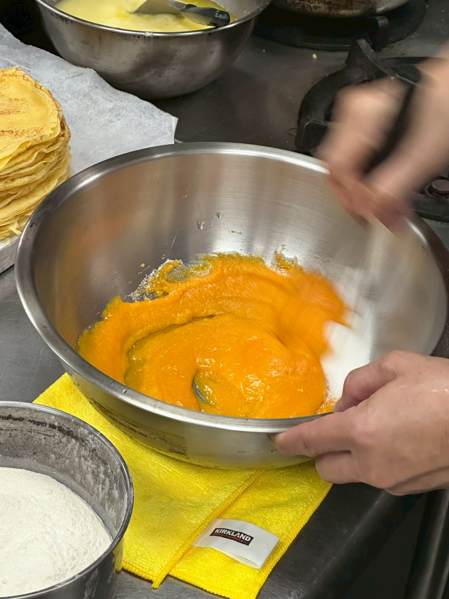

將過篩後的麵粉加入蛋黃糊中，輕輕攪拌均勻至無粉末狀。

先倒 1/3 的溫牛奶進入蛋黃糊中攪拌均勻（避免蛋黃被燙熟）。將剩餘牛奶全部倒入拌勻後，過篩回流至鍋中。以中火不斷攪拌加熱。

當液體開始冒泡並變得濃稠、呈現光澤感時即可離火。放入冰箱冷卻後即可使用。

大廚的小撇步

- 口感升級：如果想要更滑順，可以在離火後趁熱拌入約 10-15g 的冷奶油塊。
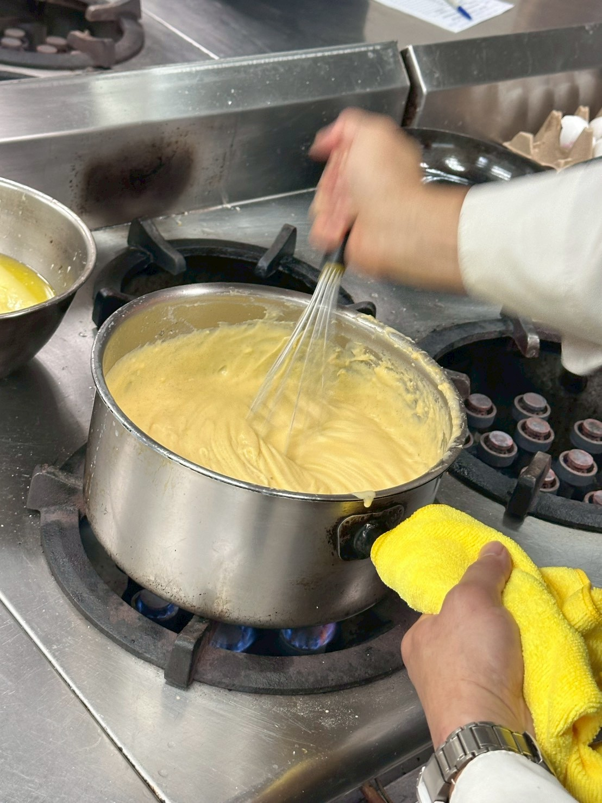

應用建議：這份食譜是搭配薄餅。您可以將薄餅煎好後，抹上一層卡士達醬，再放上水果捲起來。

### 3. 橙味沙巴雍醬汁 (Orange sabayon sauce)

| 食材品名 | 單位及數量 |
| :--- | :--- |
| 蛋黃 | 6個 |
| 甜白酒 (Moscato d'Asti 濃度5~7%) | 30ml |
| 康圖酒 (Cointreau 濃度40%) | 30ml |
| 甜橙汁 | 50ml |
| 砂糖 | 60g |

### 4. 裝飾 (Garnish)

| 食材品名 | 單位及數量 |
| :--- | :--- |
| 甜橙果肉 | 2個 |
| 草莓與其它季節水果 | 300g |
| 新鮮薄荷葉 | 數片 |
| 糖粉 | 少許 |

---

## 製作步驟

### 薄餅製作 (Crêpes)

- **粉漿調製**：混合全蛋、牛奶、麵粉並過篩。
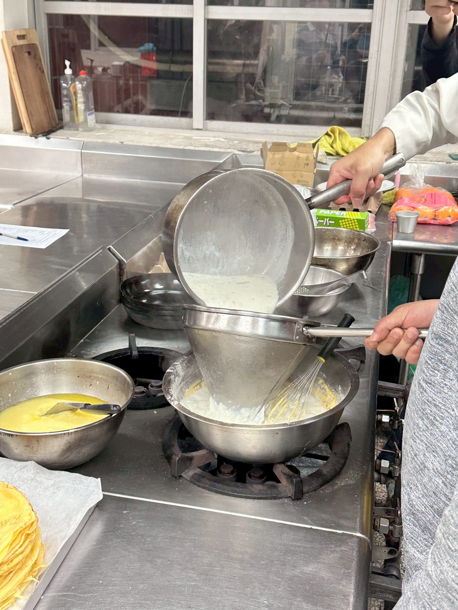
- **煎薄餅**：使用鐵鍋煎熟，注意火侯。
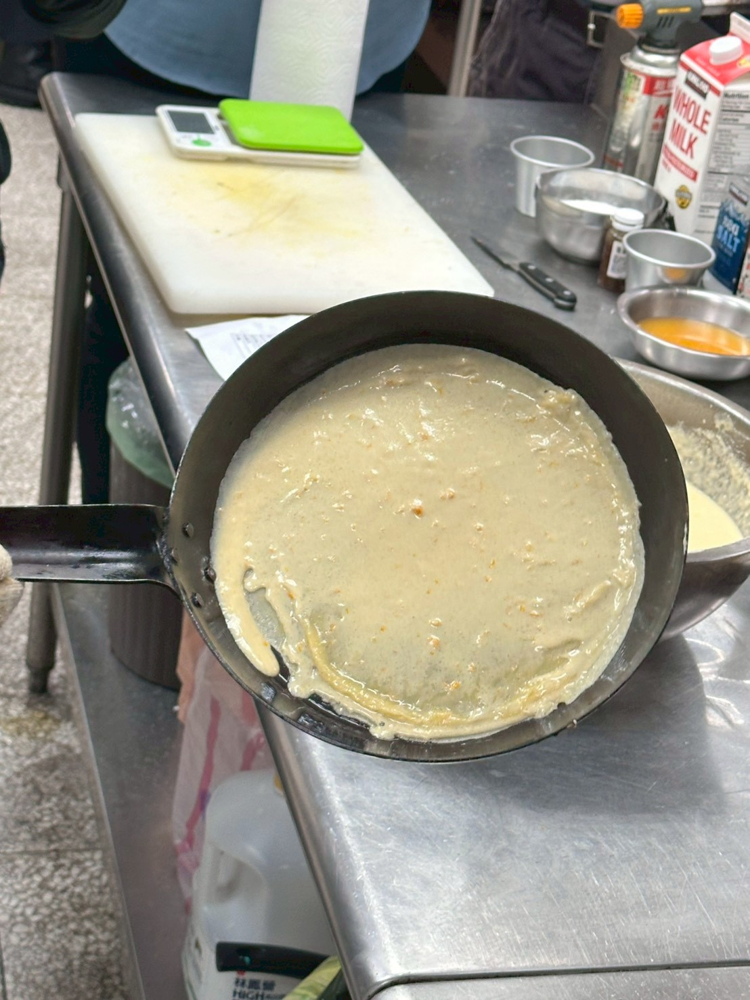
- **翻面技巧**：可以戴手套翻面比較快。
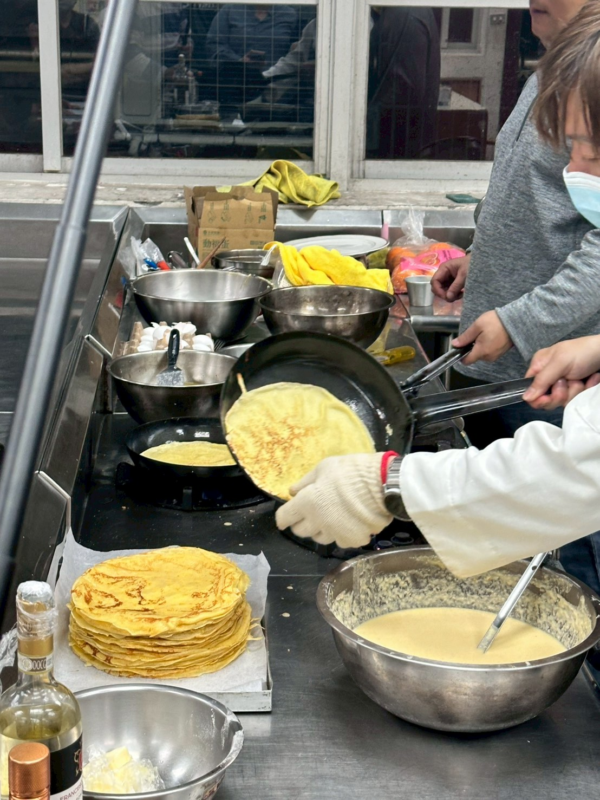

### 沙巴雍醬汁 (Sabayon)

- 將蛋黃、砂糖、甜橙汁、甜白酒與康圖酒混合後，以隔水加熱方式（Bain-marie）持續攪拌。
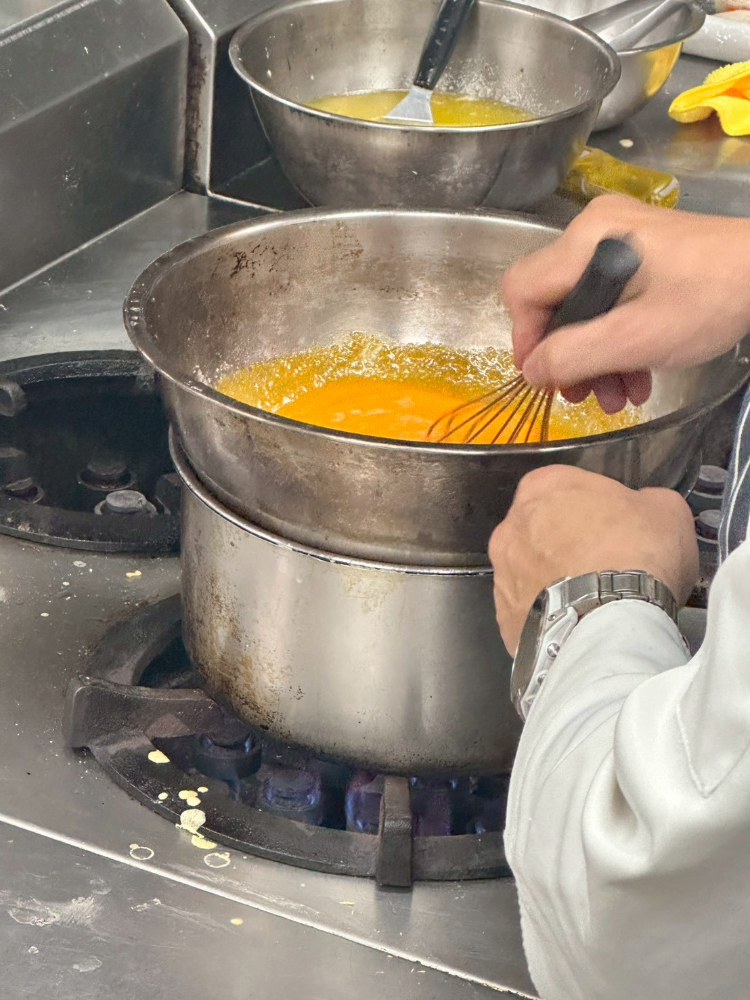

---

- **豐富裝飾**：抹上卡士達醬並搭配新鮮水果。
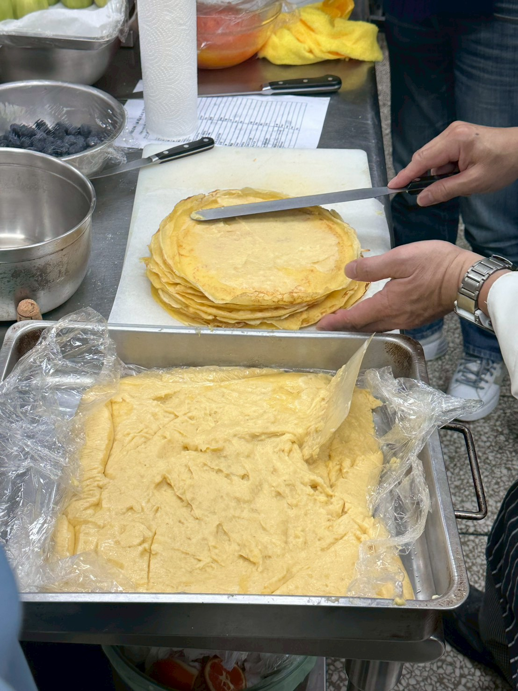
- **水果處理**：將甜橙果肉削出，點綴薄餅。
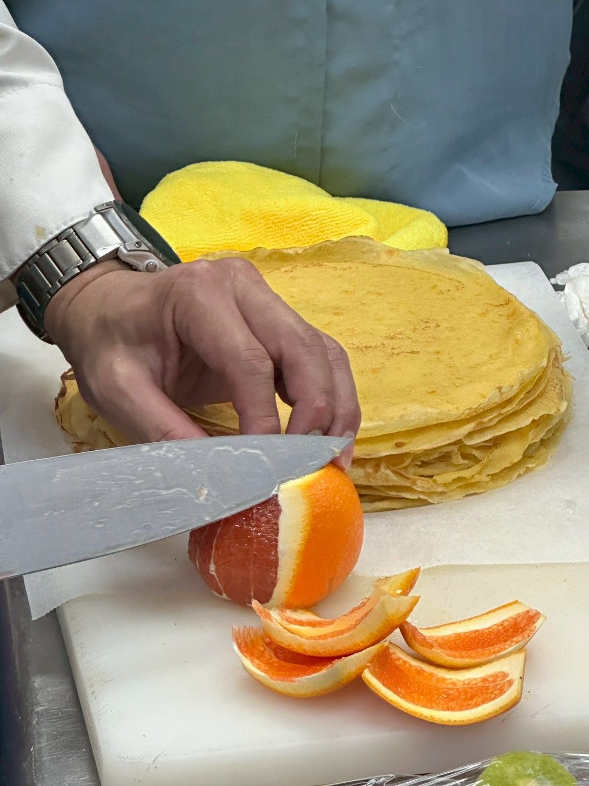
- **噴槍上色**：最後可以使用噴槍輕微上色增加風味。
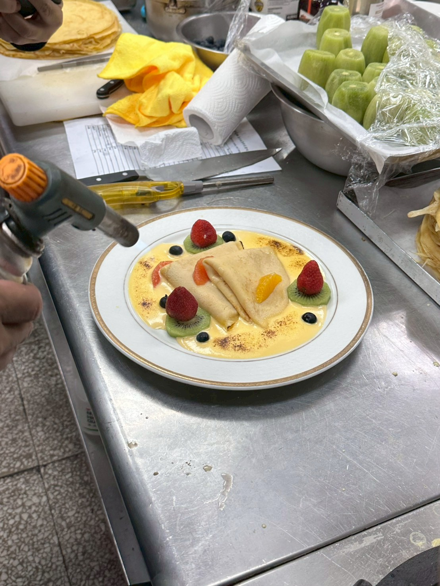

