在法式料理的殿堂中，每一道菜都是一場精密的科學實驗與藝術創作。今天我們將以「炙烤鮭魚排附水煮馬鈴薯炒蘆筍佐番茄奶油醬 (Choron Sauce)」為題，深度解構法式廚藝的四大靈魂元素。

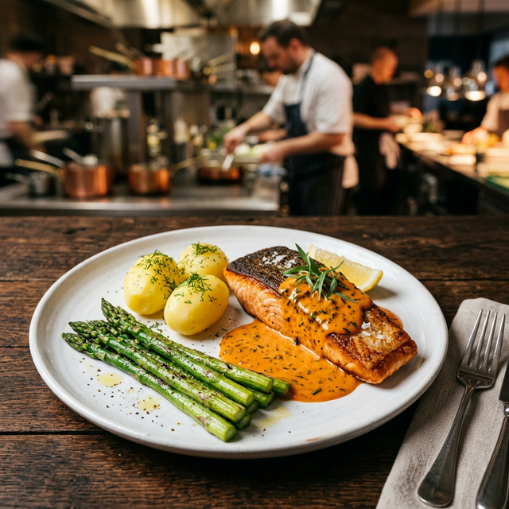

## 課前準備：精選食材與專業環境

在開始烹飪之前，準備好高品質的鮭魚排、新鮮綠蘆筍、馬鈴薯及各式香料是成功的關鍵。

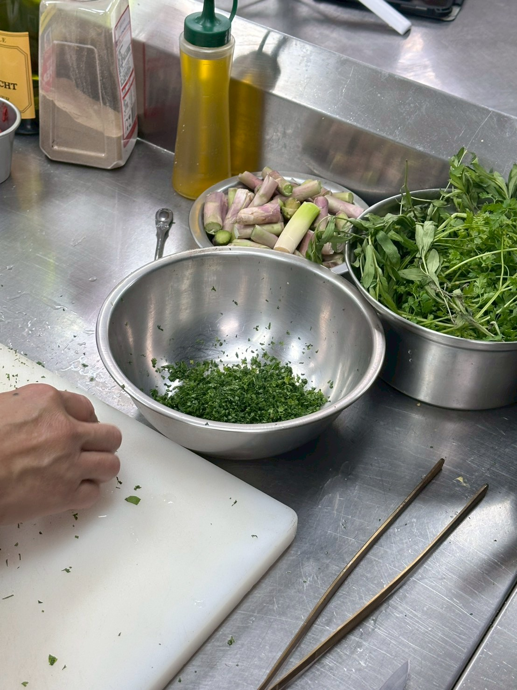

為了確保烹調過程順暢，精確的配方比例與流程是法式料理的靈魂。以下是根據實體講義所整理的技術清單：

## 精確配方與實作工藝 (Detailed Recipe)

### 1. 帶皮鮭魚排 (Grilled Salmon)

| 項目                 | 份量/標記            |
| :------------------- | :------------------- |
| **帶皮鮭魚排** | 2 片 (各約 150-200g) |
| **油脂**       | 油 30ml              |
| **調味**       | 鹽、胡椒少許         |

> [!NOTE]
> **事前處理與烹調指令**
>
> - **處理：** 魚排必須完全擦乾（此為皮脆關鍵），再依序抹上鹽、胡椒並均勻上油。
> - **順序：** 鍋內先放鹽再放入魚排。
> - **火侯：** 皮朝下先行入鍋（First），建議中心溫度控制在 **$55^{\circ}C \sim 60^{\circ}C$**。
> - **時間：** 每面煎烤約 2-3 分鐘。

### 2. 蕃茄奶油醬 (Choron Sauce)

| 材料名稱               | 份量                      | 備註                            |
| :--------------------- | :------------------------ | :------------------------------ |
| **澄清奶油**     | 200g                      | 建議溫度$60 \sim 65^{\circ}C$ |
| **蛋黃**         | 4 個                      |                                 |
| **液體基底**     | 水 40ml、白酒 80ml        |                                 |
| **酸度來源**     | 紅/白酒醋 40ml            | 若酸度不足可適量增加            |
| **香料與紅蔥頭** | 紅蔥頭碎 30g、黑胡椒碎 3g | 茵陳蒿與山蘿蔔葉各 1 小株       |
| **調味與增色**   | 蕃茄糊 20g                | 鹽、白胡椒粉少許                |

> [!IMPORTANT]
> **實作筆記 (Technique)**
>
> - **濃縮與過濾：** 混合醋、酒、黑胡椒、紅蔥頭及香料，熬煮至體積縮小（濃縮）後進行過濾。
> - **乳化：** 蛋黃加入水與濃縮液，於溫水隔水加熱（$60 \sim 65^{\circ}C$）不斷打發。
> - **組合：** 極緩慢、呈線狀滴入溫熱的澄清奶油。**提示：** 奶油不可加太快，否則會失敗（花掉）。
> - **最後步驟：** 加入蕃茄糊（顏色變紅）與新鮮切碎的香草。

### 3. 炒蘆筍 (Sautéed Asparagus)

| 食材               | 份量   |
| :----------------- | :----- |
| **綠蘆筍**   | 120g   |
| **無鹽奶油** | 30g    |
| **調味**     | 鹽少許 |

> [!TIP]
> **烹調流程**
>
> - **加鹽水煮滾後，將蘆筍汆燙 **1 分鐘**。
> - 撈出後立即冷卻（冰鎮）以鎖住翠綠。
> - 出餐前以奶油快速煎香賦味。

### 4. 英式水煮馬鈴薯 (Pommes Anglaise)

| 食材             | 份量                        |
| :--------------- | :-------------------------- |
| **馬鈴薯** | 6 個 (修剪為橄欖型)         |
| **拌料**   | 澄清奶油 60ml、巴西里碎 30g |
| **調味**   | 鹽少許                      |

> [!NOTE]
> **製作筆記**
>
> - **刀工：** 需修剪成一致的大小（約 5-6cm 長、6cm 寬，橄欖型），具備對稱的 **七個切面**。
> - **熟度：** 水滾後置入馬鈴薯，煮至叉子可輕易穿透中心（可以穿透）。
> - **完成：** 拌入澄清奶油與新鮮巴西里碎，確保香草香氣與奶油溫潤感融合。

---

## 經典料理的解剖學：各司其職的完美模組

這道料理並非單純的組合，而是由四個互補的模組構成。它們在質地、溫度與風味上達到了完美的平衡：

1. **英式水煮馬鈴薯**：負責穩固基底與溫和質地。
2. **炒蘆筍**：提供清脆口感與鮮明翠綠。
3. **Choron 番茄奶油醬**：賦予濃郁酸甜的風味靈魂。
4. **帶皮鮭魚排**：展現酥脆與軟嫩對比的主角。

---

## 模組一：馬鈴薯的法式刀工藝術 (Tourné)

法式料理對美的追求始於刀工。**Tourné (削邊)** 技術不只是為了美觀，更是確保每一顆馬鈴薯在水煮過程中「受熱面積一致」，達到完美同步的熟度。

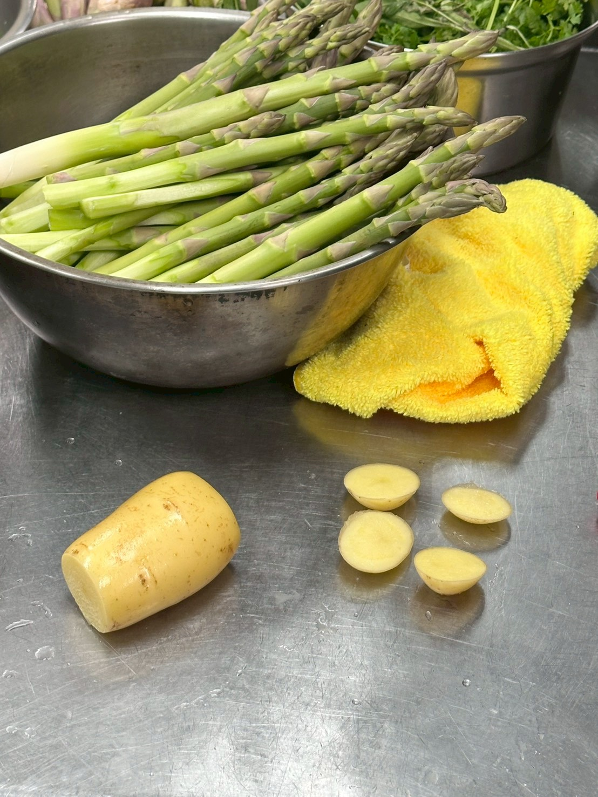

削好的馬鈴薯需要保持形狀對稱，並在烹調前妥善瀝乾水分。

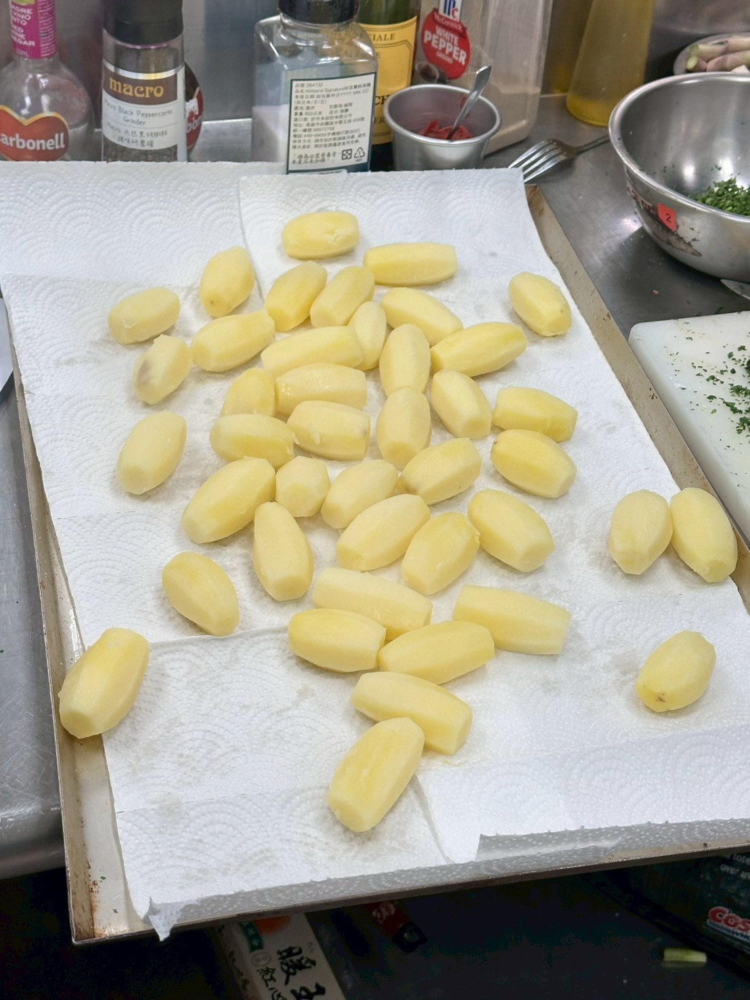

### 烹調要點

- **形狀：** 削成七面等大的「橄欖型」。
- **熟化：** 水中加入少許鹽，滾水煮至中心熱透鬆軟（可以穿透）。
- **賦味：** 趁熱拌入 **60ml 澄清奶油** 與 **30g 巴西里碎**，利用熱度喚醒奶油香氣。

---

## 模組二：蘆筍的「殺青」科學

蘆筍的翠綠來自於精準的溫度控制。透過 **Blanching (殺青)** 與 **Shocking (冰鎮)**，我們能鎖住葉綠素。

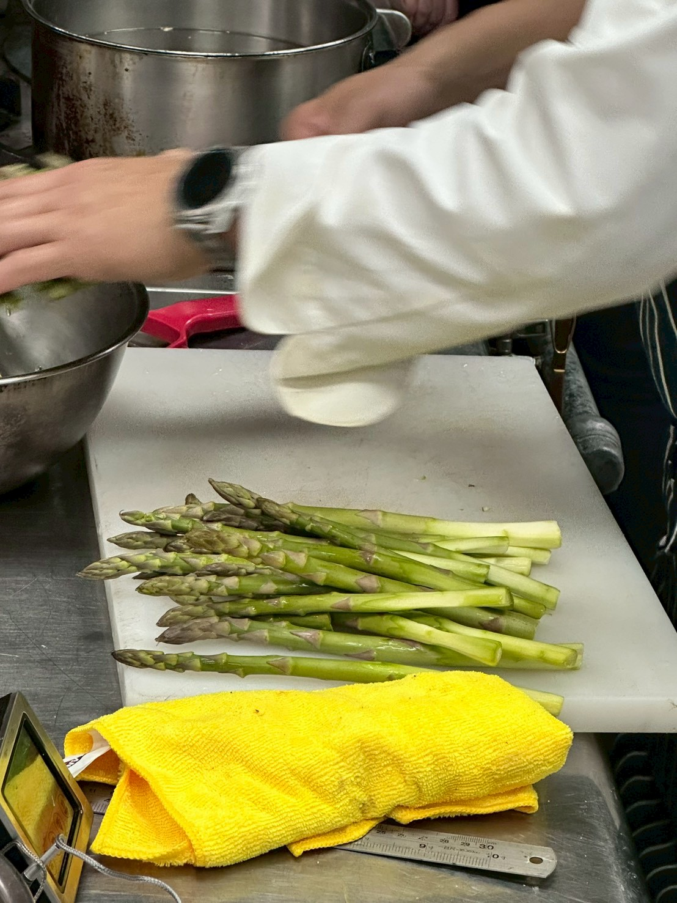

透過專業的十字刀工與去皮處理，確保蘆筍在短時間內受熱均勻。

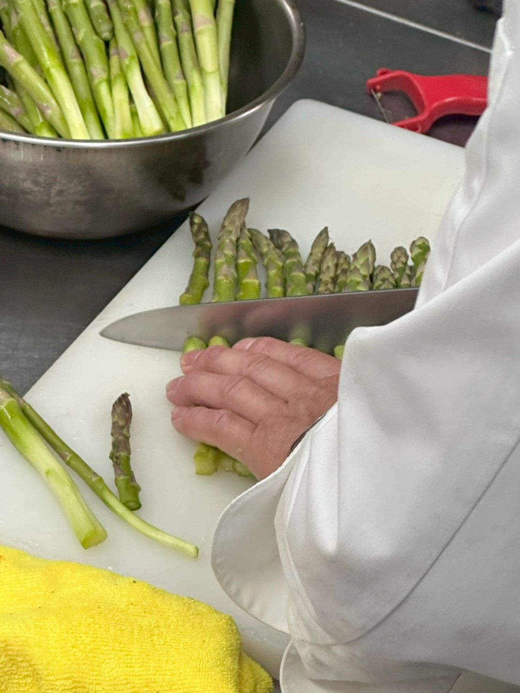

### 關鍵數字

1. **1 分鐘：** 將蘆筍投入加鹽滾水中精準汆燙，破壞致使蔬菜變色的酵素。
2. **0°C：** 撈起後立刻移入冰水中，極速降溫終止餘溫熟成，保證爽脆口感。
3. **奶油香煎：** 最後以 30g 無鹽奶油快速拌炒，賦予果仁般的梅納香氣。

---

## 模組三：醬汁靈魂的乳化藝術 (Choron Sauce)

Choron Sauce 是經典 Bearnaise Sauce 的變體，加入了番茄糊，色澤橘紅誘人。

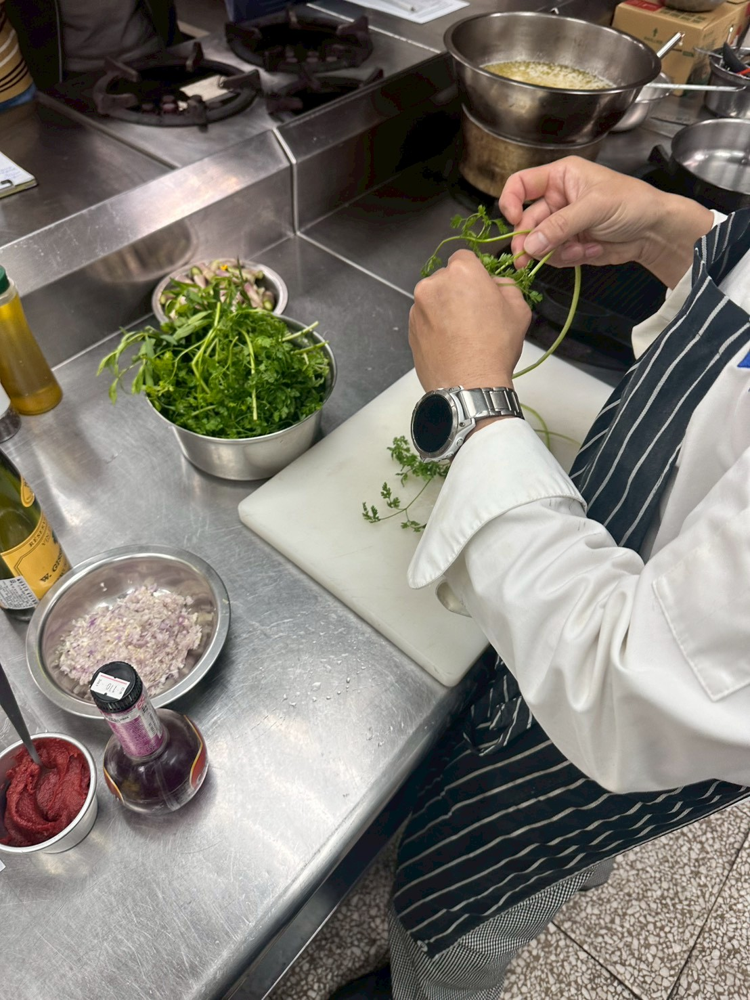

首先處理濃縮液，這是醬汁中酸度與香氣的核心。

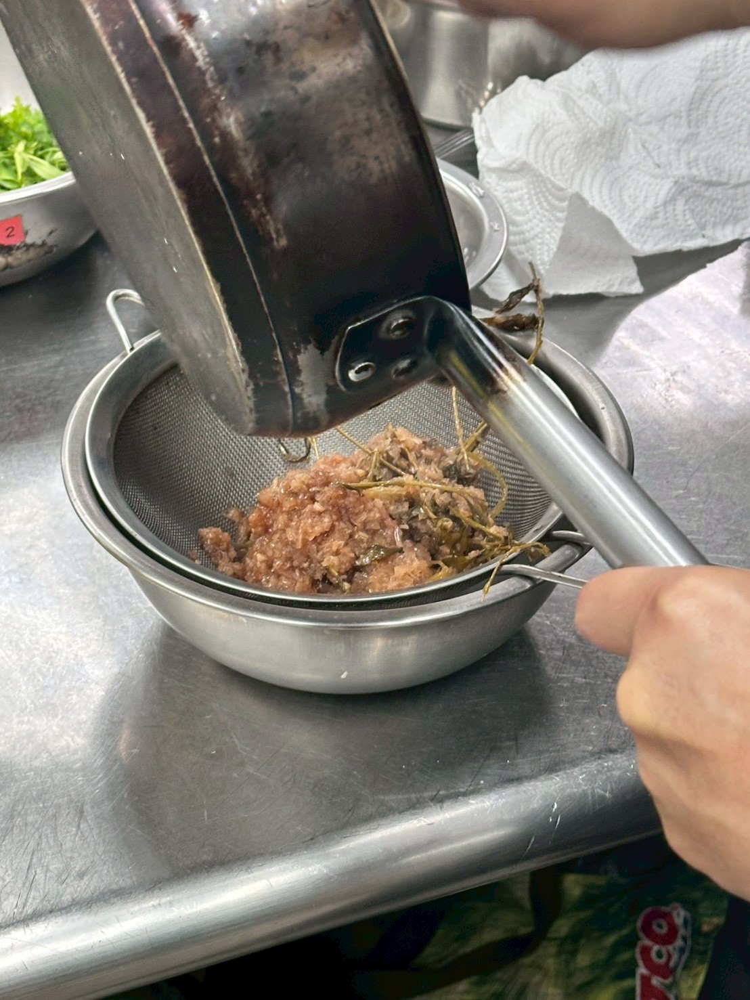

接著處理澄清奶油，這是確保醬汁絲滑不焦化的關鍵。

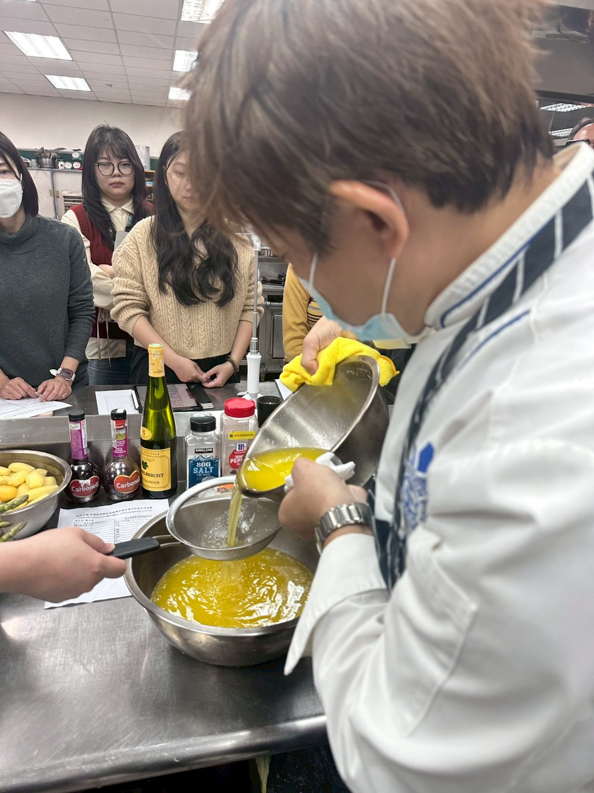

接著在隔水加熱的環境中進行乳化，這需要極大的耐性與精準的動作。

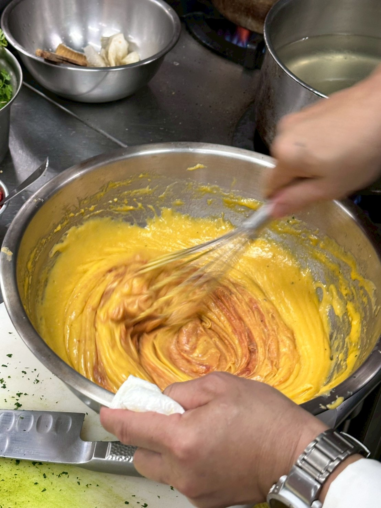

### 實作工藝

- **濃縮液 (Reduction)：** 白酒、酒醋、紅蔥頭與黑胡椒碎熬煮濃縮至精華，這是醬汁的酸度來源。
- **Sabayon (蛋黃糊)：** 隔水加熱（60-65°C）不斷畫「8」字攪拌，直到膨脹成絲滑泡沫狀，**絕對禁止底座接觸沸水**，否則會變成炒蛋。
- **乳化：** 以「極細線狀」慢慢滴入澄清奶油，利用高速剪切將油脂打碎於水分中。

---

## 模組四：炙烤鮭魚排的梅納反應

鮭魚排的成敗在於「乾燥」與「溫控」。

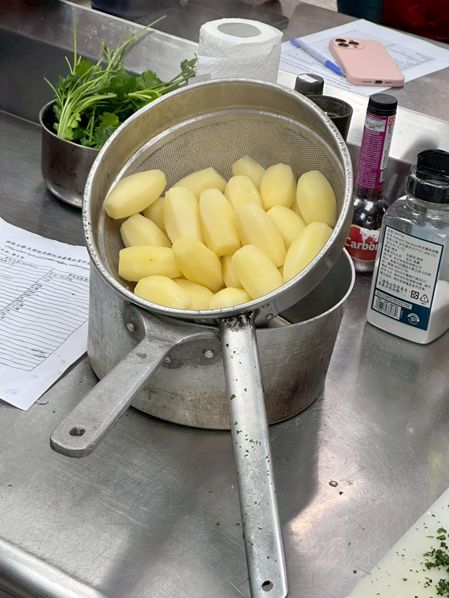

所有鮭魚排在入鍋前都整齊排列並徹底吸乾水分，確保魚皮的酥脆。

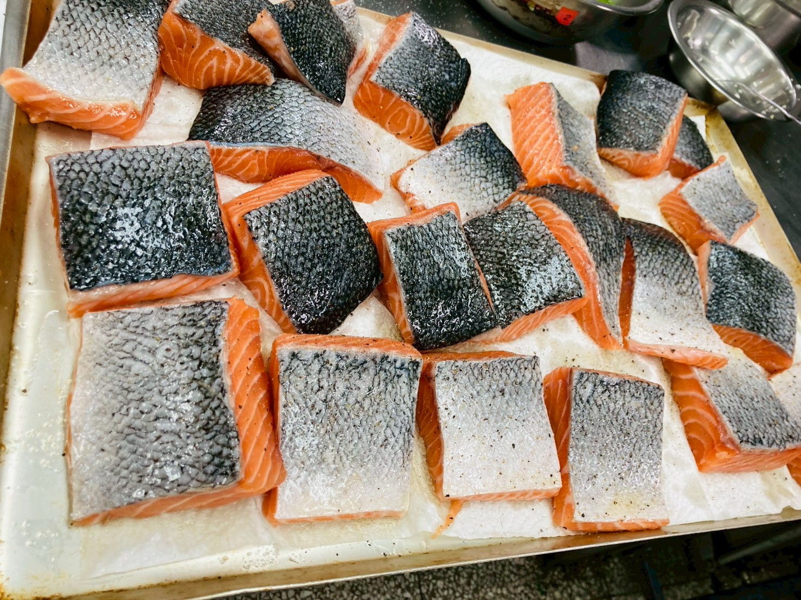

主廚現場演示如何檢查並準備每一塊鮭魚，確保魚皮朝下時能達到最佳的酥脆度。

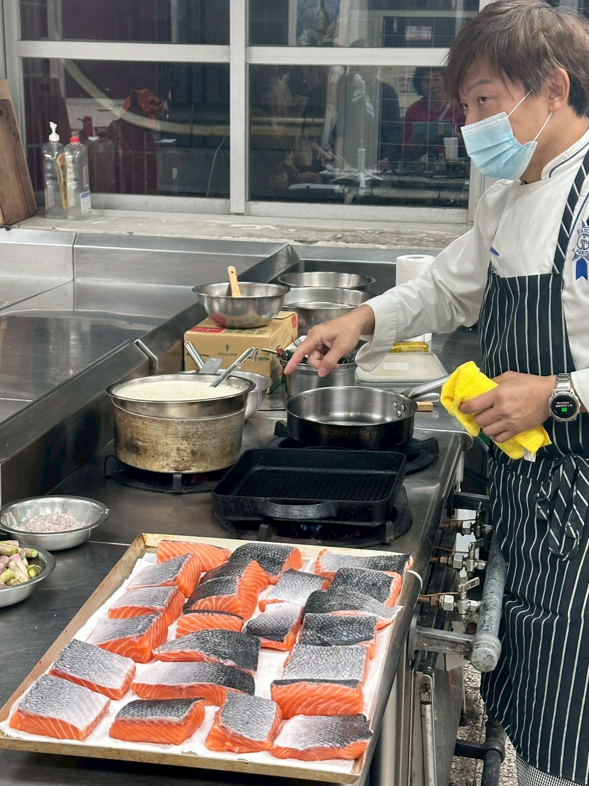

入鍋後，精準的火候分配是呈現外焦里嫩的關鍵。

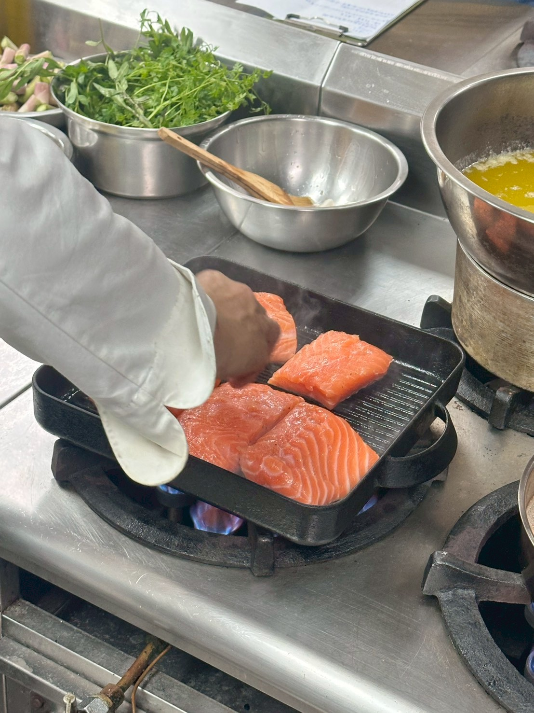

### 專業準則

- **絕對乾燥：** 入鍋前必須徹底擦乾魚皮水分，這是觸發完美梅納反應的先決條件。
- **溫度控制：** 控制在 **55°C ~ 60°C**。
- **皮朝下：** 魚皮作為天然隔熱層，保護魚肉免受高溫破壞，同時煎出極致酥脆。每一面預估僅需 2-3 分鐘。

---

## 重組與昇華：餐盤上的交響樂

當所有組件完成，最後的擺盤如同樂團齊奏：

- **底蘊：** Choron 醬汁微酸鮮甜，完美切割鮭魚油脂。
- **基石：** 橄欖型馬鈴薯提供飽足感與溫潤感。
- **點綴：** 綠蘆筍帶來清爽視覺與口感。

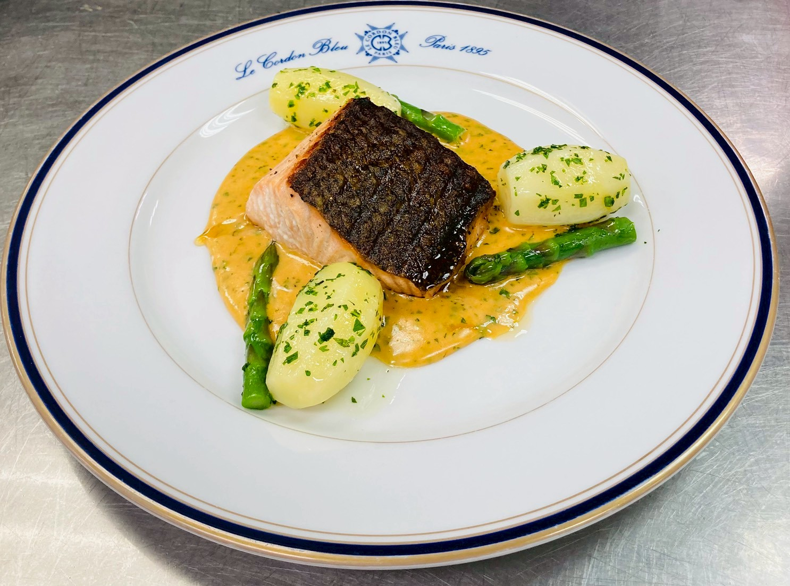

盤中的每一個元素都閃耀著專業的光芒，最後的碎香料點綴更增添了視覺層次。

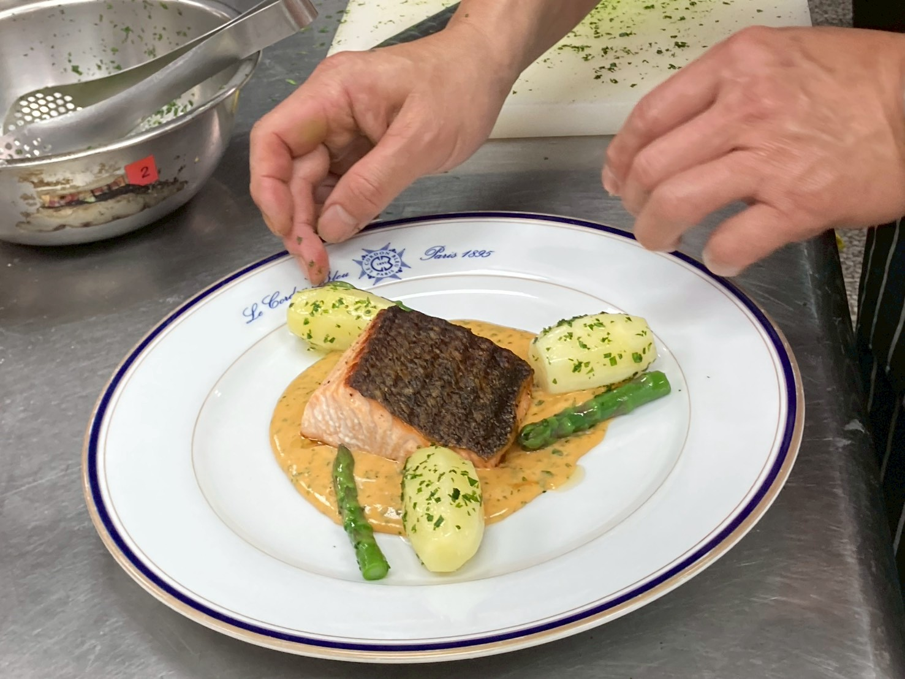

---

> **備忘錄**
>
> - **精準控溫**：從魚皮的 55°C 到乳化醬汁的溫和蒸氣，溫度決定質地成敗。
> - **分秒必爭**：蘆筍的一分鐘與極速冰鎮是保衛食材原色的關鍵。
> - **紀律與耐心**：無論是完美的七面橄欖型，還是耐心滴入澄清奶油，美味藏在細節裡。
