## 課程摘要

這道經典的「英式炸魚薯條」重點在於麵衣的酥脆度。透過 **冰啤酒**、泡打粉以及在來米粉的組合，結合**冷藏靜置**與**二炸逼油**技術，能創造出充滿空氣感且乾爽不油膩的極致脆度。搭配特製的薄荷青豆泥，可以有效平衡油炸物的負擔感。

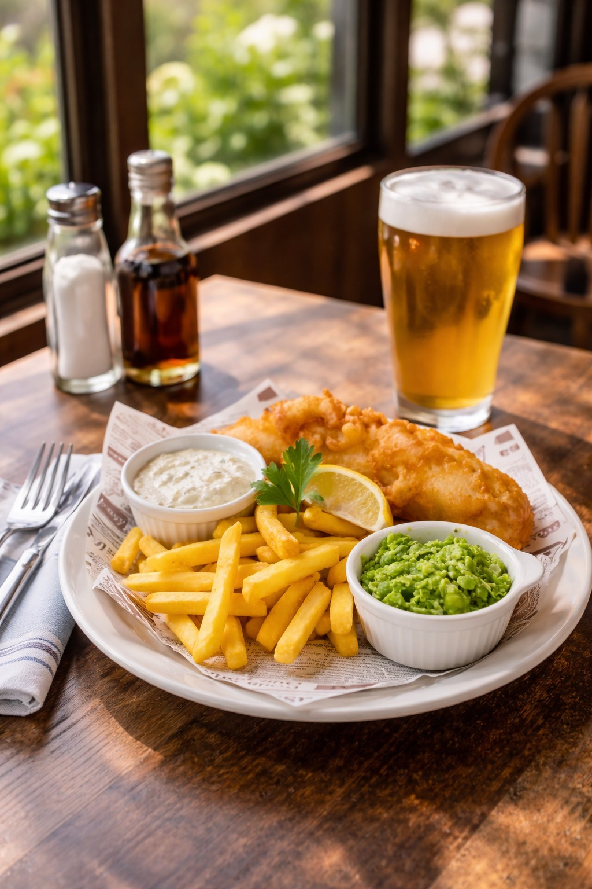

---

## 食材清單

### 主料
| 食材品名 | 單位及數量 | 備註 |
| :--- | :--- | :--- |
| **扁鱈/比目魚** | 750g | 需去皮，務必完全擦乾水分 |
| **麵粉** | 100g | 乾粉（底粉）使用 |
| **鹽及黑胡椒** | 少許 | **入鍋油炸前**才撒上調味 |

### 啤酒麵衣 (Beer Batter)
| 食材品名 | 單位及數量 | 備註 |
| :--- | :--- | :--- |
| **啤酒** | 200ml | 推薦德國 HB 啤酒，**務必冰鎮使用** |
| **中筋麵粉** | 80g | |
| **在來米粉** | 60g | 提升爽脆度的關鍵 |
| **泡打粉** | 5g | 提供空氣感 |

### 塔塔醬 (Tartar Sauce)
* **美乃滋 (Costco 鹹味)**：400g
* **第戎芥末醬**：30ml
* **洋蔥、酸豆、酸黃瓜**：各 80g (切碎)
* **檸檬汁**：1/2 個 (視味道調整)
* **新鮮巴西里葉碎**：適量

### 青豆泥 (Mushy Peas)
* **冷凍青豆仁**：300g
* **紅蔥頭碎**：80g
* **無鹽奶油**：80g (分次使用)
* **薄荷葉**：1 小把 (切碎)

---

## 製作步驟

### 1. 處理鮮魚：防出水的關鍵
首先進行魚排去皮。**比目魚去皮後，務必用廚房紙巾將表面水分完全擦乾備用。**

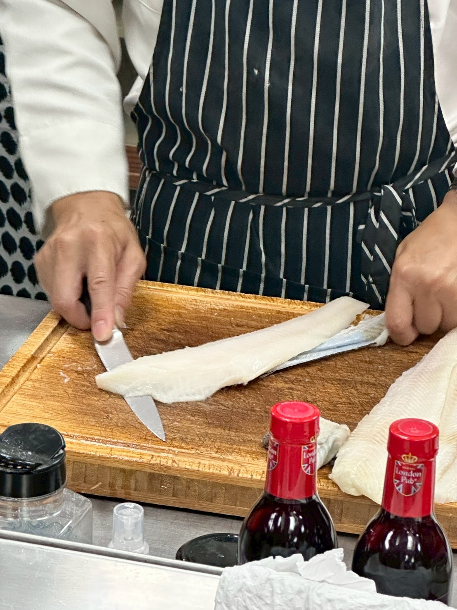

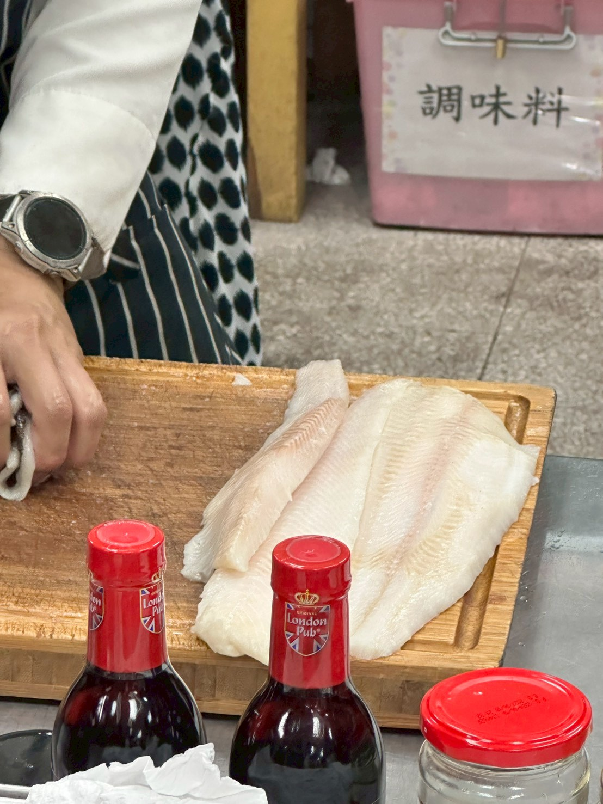

將魚排切成適合油炸的厚度，確保每塊受熱均勻。

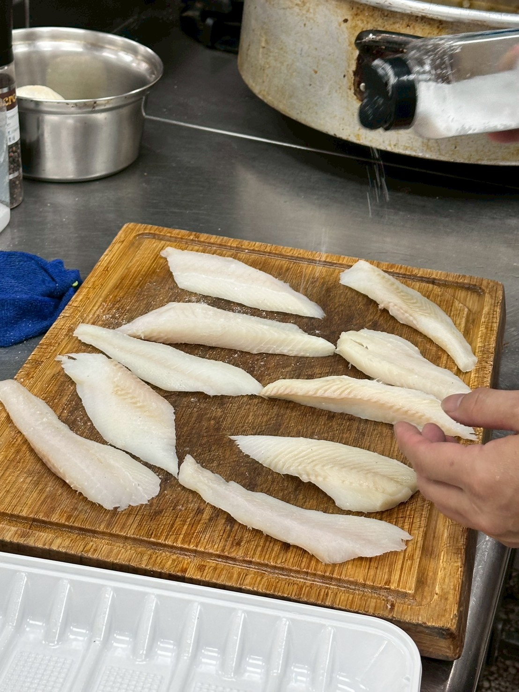

* **重點**：鹽與黑胡椒必須在「準備下鍋前」才撒上。過早撒鹽會導致魚肉出水，影響麵衣附著。

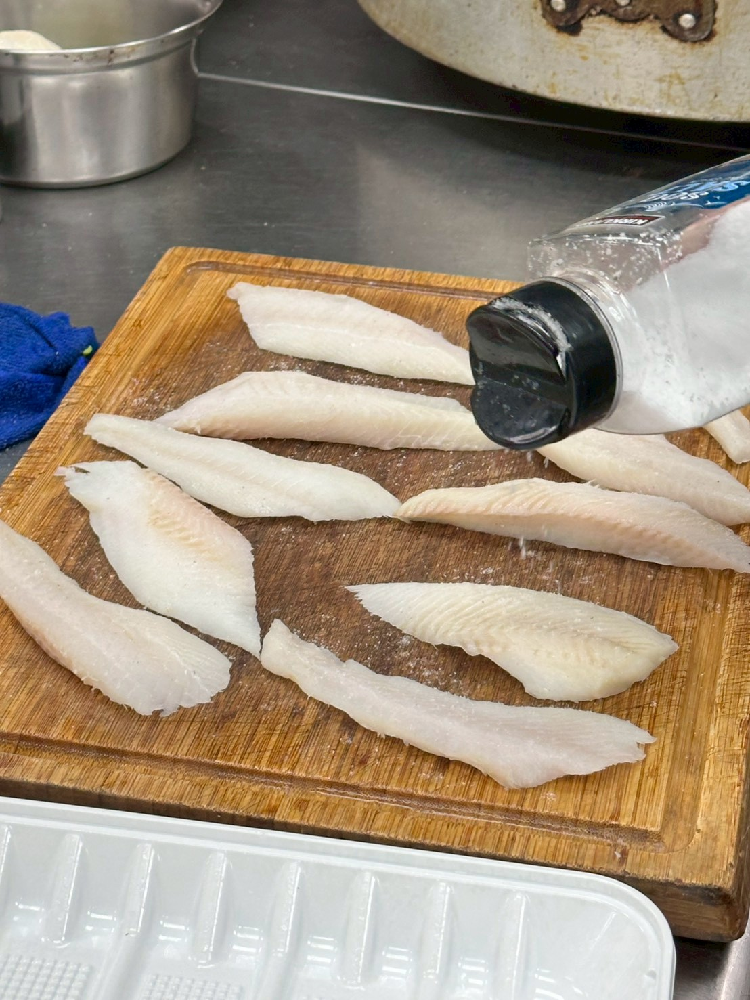

### 2. 調製啤酒麵糊：冷藏靜置
將中筋麵粉、在來米粉、泡打粉與鹽混合，倒入冰啤酒。
* **攪拌要點**：攪拌至**帶有顆粒**即可，千萬不可過度攪拌，防止出筋導致口感不酥。
* **關鍵工序**：調製好的麵糊需放入冰箱**冷藏靜置 30 分鐘**。

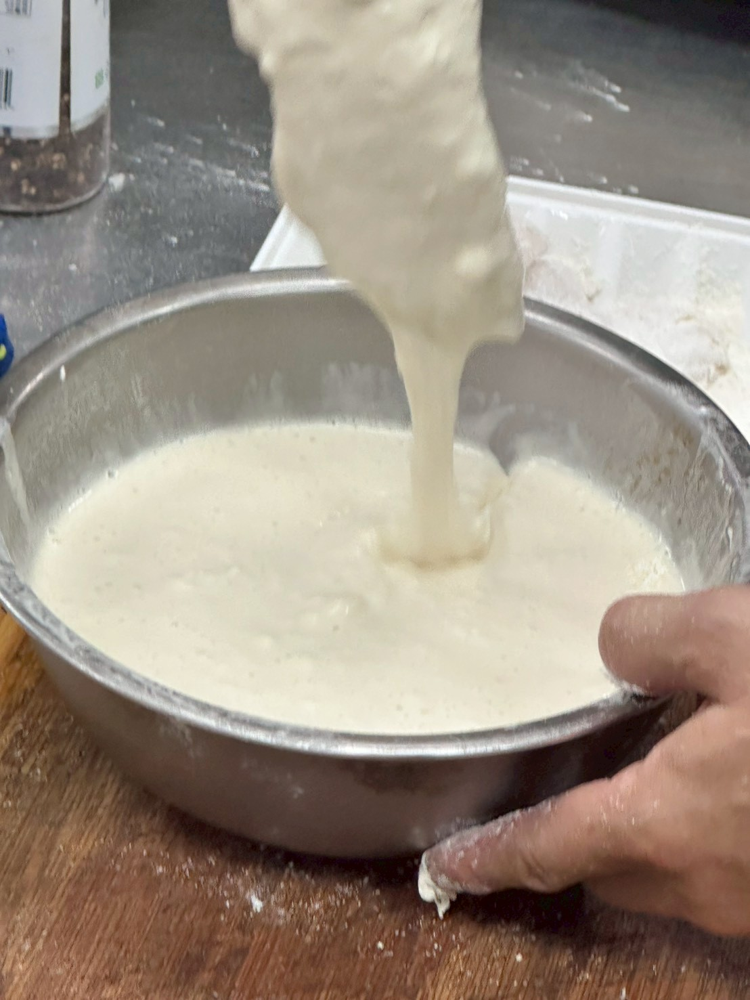

### 3. 製作塔塔醬
將酸豆、酸黃瓜、洋蔥、巴西里葉碎與美乃滋、芥末醬混合。
* **試味**：攪拌後務必先試味道，若酸鹹度不足，再適度補上鹽或檸檬汁。

### 4. 炒製青豆泥：保留質地

1. 鍋中放奶油炒香紅蔥頭碎。

    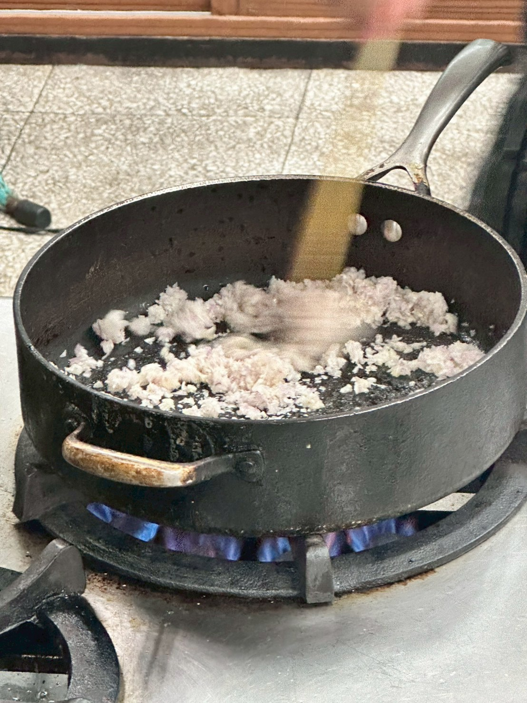

2. 放入青豆仁、鹽、黑胡椒炒熱。

    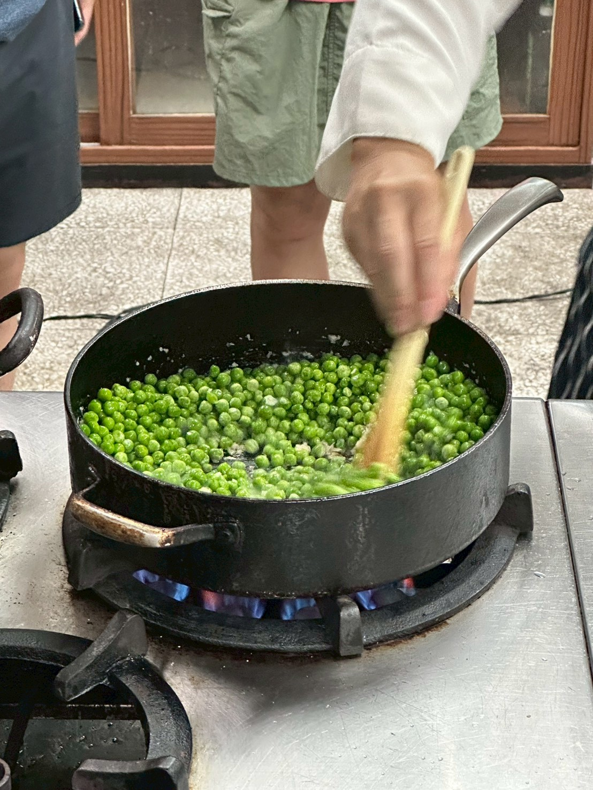

3. 加入薄荷末拌炒後熄火。
4. **質地處理**：利用調理機稍微打成泥，但**需保留部分顆粒感**。

    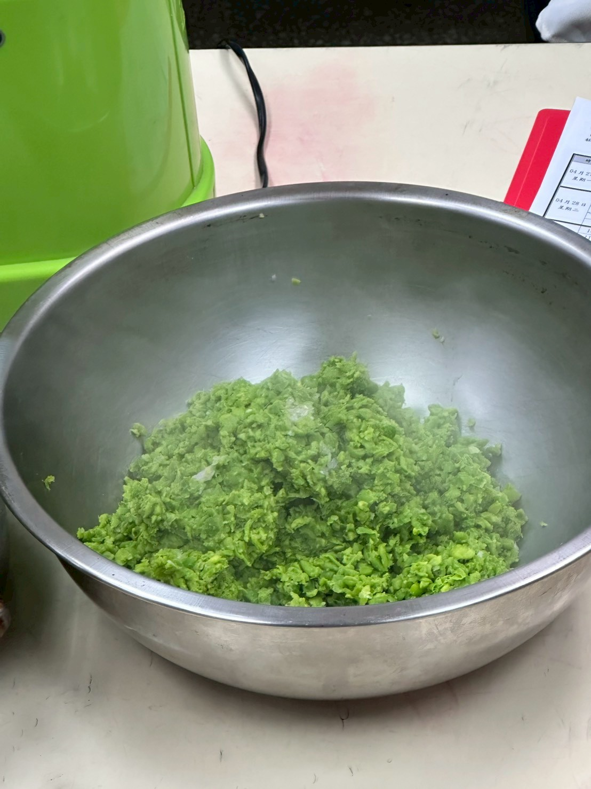

5. **乳化**：最後趁熱加入一塊冷凍奶油拌勻，增加光澤感。

### 5. 油炸工法：二炸逼油

1. 魚片均勻裹上底粉（麵粉），拍掉餘粉。
2. 浸入冷藏過的啤酒麵糊，確保完全覆蓋。

    .jpg>)

3. 放入 180 度油溫炸至金黃起鍋。

    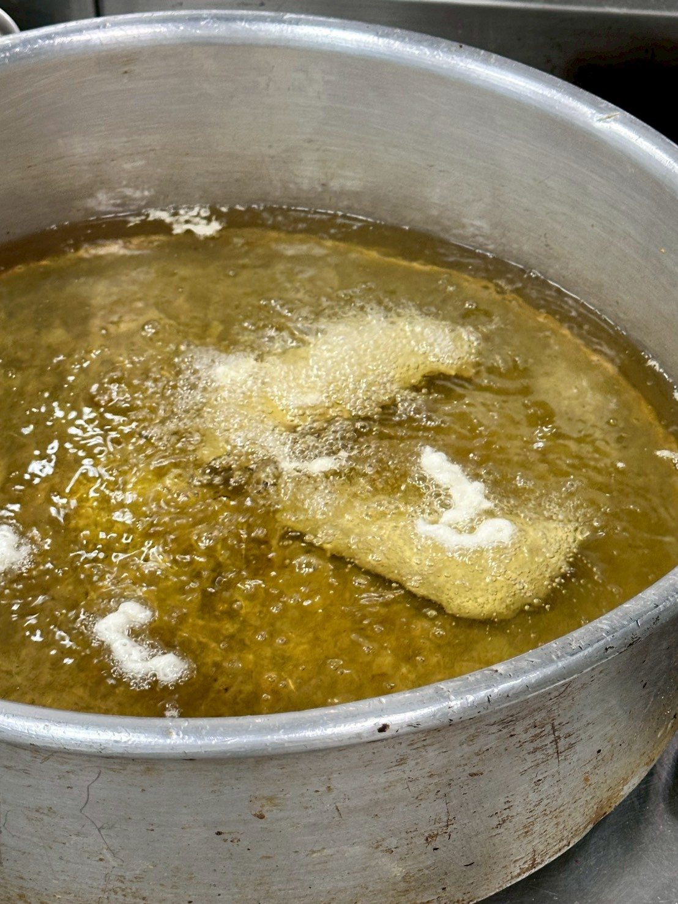

4. **二炸技術**：稍作靜置後進行**第二次油炸**，此步驟能將多餘油脂逼出，確保麵衣外殼長久酥脆。

---

## 技術筆記與總結

* **為什麼要冰啤酒？** 低溫麵糊與高溫油產生的溫差，能讓氣體劇烈膨脹，創造蜂巢狀的鬆脆結構。
* **在來米粉的作用**：米粉不含麩質，能阻斷筋性產生，並吸收較少油脂，讓外殼更薄更脆。
* **薯條搭配**：推薦選用粗短規格的薯條，淋上麥芽醋 (Malt vinegar) 是最道地的吃法。

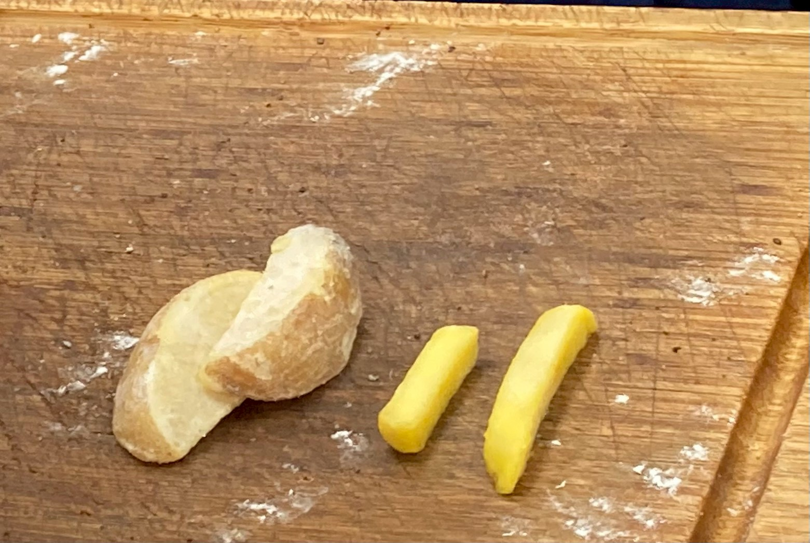

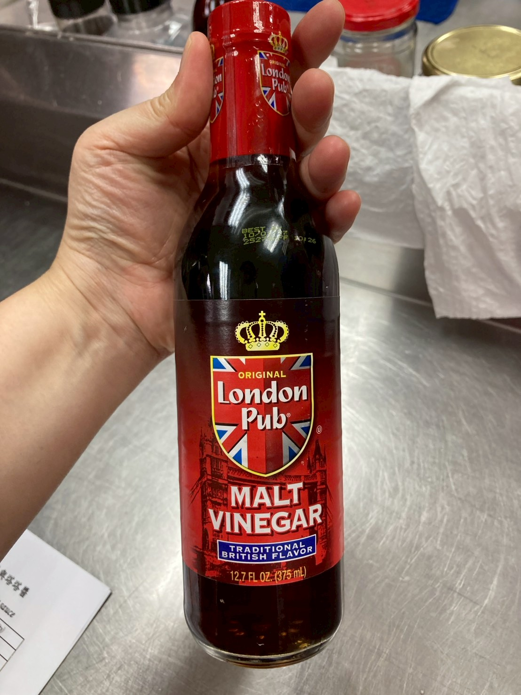

這份食譜強調了「水分管理」與「溫度差」，只要落實這兩個細節，就能炸出專業水準的炸魚薯條。

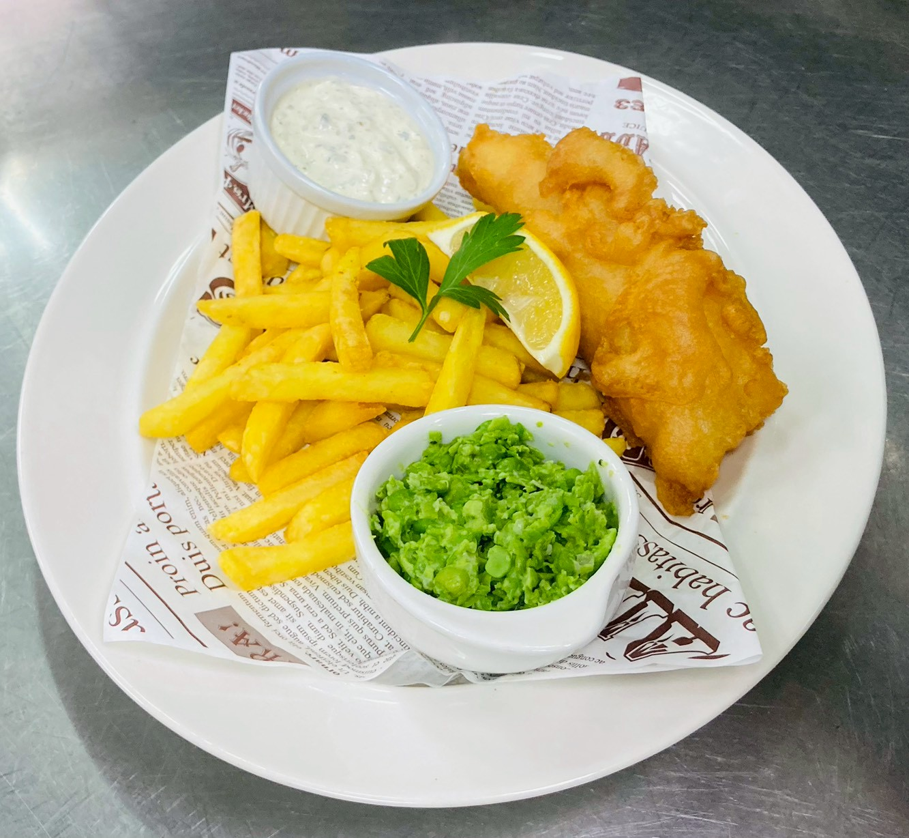