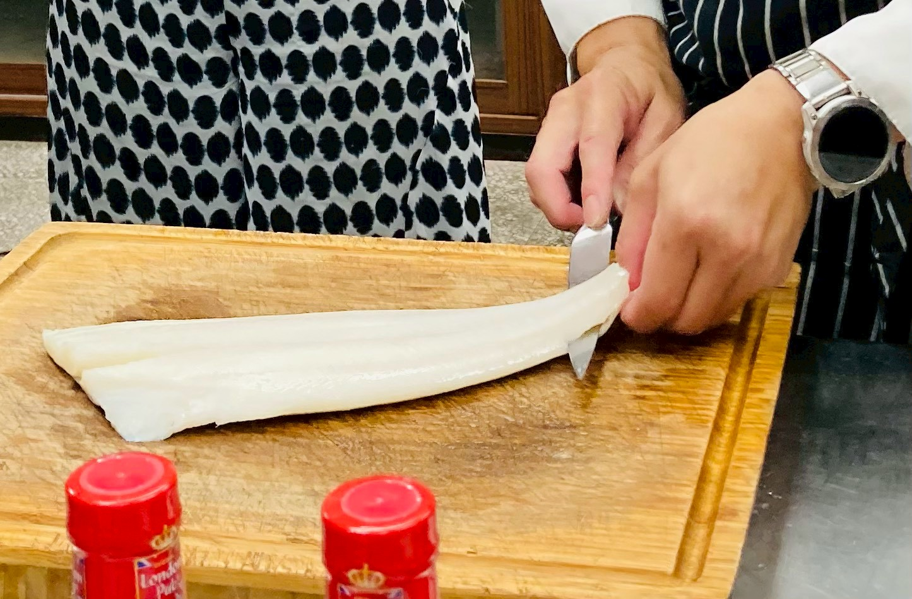
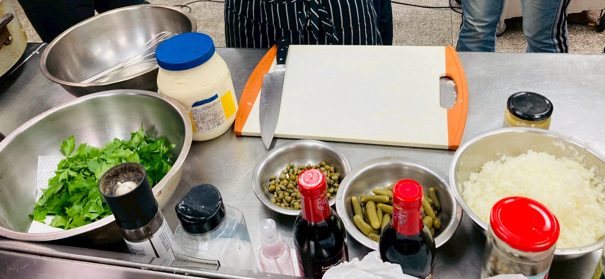

## 課程摘要

這道經典的「英式炸魚薯條」重點在於麵衣的酥脆度。透過啤酒、泡打粉以及在來米粉的組合，能創造出充滿空氣感且不油膩的脆度。搭配特製的薄荷青豆泥，可以有效平衡油炸物的負擔感。

---

## 食材清單

### 主料

| 食材品名 | 單位及數量 | 備註 |
| :--- | :--- | :--- |
| **扁鱈** | 750g | 也可用比目魚或其他白肉魚排替代 |
| **麵粉** | 100g | 乾粉（底粉）使用 |
| **鹽及胡椒** | 少許 | 調味用 |

### 啤酒麵衣 (Beer Batter)

* **啤酒**：180ml
* **中筋麵粉**：80g
* **在來米粉 (Rice flour)**：60g
* **泡打粉 (Baking powder)**：5g
* **鹽**：少許

### 塔塔醬 (Tartar Sauce)

* **美乃滋**：400g
* **第戎芥末醬 (Dijon mustard)**：30ml
* **洋蔥**：1/2 個
* **酸豆**：80g
* **酸黃瓜**：80g
* **檸檬汁**：1/2 個
* **新鮮巴西里葉碎**：1 小把

### 青豆泥 (Mushy Peas)

* **冷凍青豆仁**：300g
* **鮮奶油**：50ml
* **紅蔥頭碎**：80g
* **無鹽奶油**：80g
* **薄荷葉**：1 小把
* **鹽及胡椒**：適量

### 裝飾與食用建議

* **炸薯條**：500g
* **麥芽醋 (Malt vinegar)**：60ml
* **檸檬**：2 個

---

## 製作步驟

### 1. 處理鮮魚與備料

首先處理魚排，若使用整尾魚需先進行去皮與分切處理。

將魚肉切成適合油炸的大小，厚度要均勻以確保受熱一致。

### 2. 調製經典塔塔醬

將所有的蔬菜配料切碎，與美乃滋基底混合。這款醬汁的酸度是這道菜的靈魂，能有效解膩。

### 3. 製作薄荷青豆泥

1. 使用奶油將紅蔥頭碎炒至透明發香。
2. 加入冷凍青豆仁翻炒均勻。
3. 加入鮮奶油、新鮮薄荷葉後，用手持攪拌棒打成細緻的泥狀。

### 4. 裹粉與油炸

**酥脆關鍵：** 在要下鍋炸之前才在魚塊上撒鹽與黑胡椒。

將魚塊均勻沾上一層薄粉作為底粉，然後放入調製好的啤酒麵衣中。

> [!TIP]
> 麵衣混合後不宜過度攪拌，看到濃稠感即可，過度攪拌會產生筋性導致口感變硬。

.jpg)

放入 170-180°C 的油鍋中，炸至兩面呈金黃色。

### 5. 成品擺盤

搭配現炸的薯條（可混搭馬鈴薯與地瓜），盛上青豆泥與塔塔醬。

最後別忘了英式吃法的精髓：**麥芽醋**。在熱騰騰的炸魚上噴灑些許麥芽醋，能瞬間提升風味層次。

---

## 筆記重點與實作技巧

### 1. 麵衣的關鍵

加入**在來米粉**是為了降低筋性，讓麵衣口感更像日式天婦羅般輕盈酥脆，而**啤酒**中的二氧化碳則會讓麵衣在油炸瞬間膨脹，形成內部細小的氣孔。

### 2. 青豆泥的風味

加入**薄荷葉**是靈魂所在，薄荷的清爽可以完美消解魚排的厚重。

### 3. 食用儀式感

這道菜最傳統的吃法是在炸魚上噴灑**麥芽醋**，醋的酸度能帶出魚肉的鮮甜並中和油脂味。

