這是一道正統法式白醬燴雞（Fricassée de Poulet），以牛肝菌（Porcini）泡發後的菌湯為基底，結合鮮奶油與生奶油麵糊勾芡，醬汁層次豐富而不膩；披拉夫飯（Pilaf Rice）以印度米在奶油中翻炒再以高湯燜入烤箱，每粒米飯粒粒分明，飽含奶香。整道料理從高湯、主菜到配飯皆自製，是法式料理課程中技法最系統化的代表作之一。

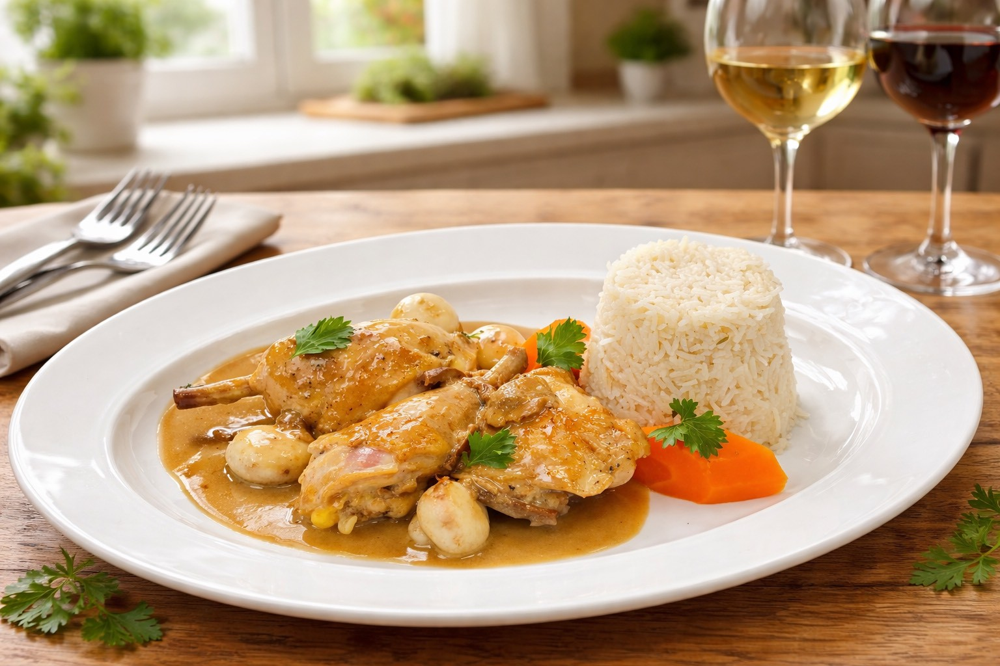

---

## 雞高湯基礎 (White Chicken Stock)

### 材料表

| 食材 | 份量 | 備註 |
| :--- | :--- | :--- |
| 雞骨架 | 2 Kg | 清洗後汆燙去血水 |
| 水 | 4000 ml | 冷水起鍋 |
| 紅蘿蔔 | 150 g | |
| 洋蔥 | 1 個 | |
| 西芹 | 2 根 | |
| 蒜苗白 | 100 g | |
| 大蒜 | 2 粒 | |
| 丁香 | 3 支 | |
| 胡椒粒 | 12 粒 | |
| 香草束 | 1 捲 | Bouquet garni |

---

## 📌 食材準備清單 (Mise en place)

### 牛肝菌奶油燴雞

| 區塊 | 食材 | 份量 | 備註 |
| :--- | :--- | :--- | :--- |
| **主材** | 雞 | 1 隻 | 切8塊備用，雞架保留熬醬 |
| | 白酒 (White Wine) | 200 ml | |
| | 白蘭地 (Brandy) | 50 ml | 嗆鍋用，須表面燒火去酒精 |
| | 鮮奶油 (Cream) | 250 ml | |
| | 澄清奶油 (Clarified Butter) | 適量 | 煎雞、炒香基底用 |
| **蔬菜基底** | 洋蔥 | 1 個 | 切碎 |
| | 西芹 | 2 根 | 切段 |
| | 紅蘿蔔 | 1 根 | 切塊 |
| | 大蒜 | 數粒 | |
| | 紅蔥頭 (Shallots) | 8 粒 | 切末，炒出香氣 |
| **香料** | 牛肝菌菇 (Porcini) | 30 g | 乾燥，需泡發；泡菌水保留過濾備用 |
| | 香草束 (Bouquet garni) | 1 捲 | 巴西里梗 / 百里香 / 月桂葉 / 茵陳萵 |
| **芡料** | 生奶油麵糊 (Beurre manié) | 適量 | 室溫奶油＋等量麵粉，揉成膏狀備用 |

### 披拉夫飯

| 區塊 | 食材 | 份量 | 備註 |
| :--- | :--- | :--- | :--- |
| **主材** | 印度米 (Basmati Rice) | 200 g | 洗 2～3 遍，瀝乾備用 |
| | 雞高湯 | 350 ml | 高湯：米 = 1.75：1 |
| **調味** | 洋蔥碎 | 1/2 個 | |
| | 澄清奶油 | 適量 | 炒米用 |
| | 無鹽奶油 | 適量 | 出爐後拌入 |
| | 香草束 | 1 捲 | 百里香 / 月桂葉 / 巴西里梗 |

### 炒蘑菇

| 食材 | 份量 | 備註 |
| :--- | :--- | :--- |
| 蘑菇 | 適量 | 清洗瀝乾，去蒂頭 |
| 澄清奶油 | 適量 | |
| 鹽 | 少許 | |

---

## ✂️ 整雞前置處理

拿到整雞後，依序完成以下修整再分切：

1. **去頭頸**：將雞頭連脖子整段剃除，**脖子油皮（頸部多餘脂肪皮）去除**，不用於主菜；脖子肉與頸骨保留用於熬醬汁基底。
2. **去翅尖**：末端雞翅（第三節翅尖）剃除不用，翅中、翅根保留。
3. **去雞爪**：剃除雞爪備用或丟棄。
4. **去尾臊（屁股）**：尾部腺體整段去除，可能有異味。
5. **分切8塊**：從關節處精準下刀，分切為：雞胸×2、雞腿×2、雞翅×2、雞腿上部×2，共8件；**雞骨架保留**，用於醬汁基底。

> **保留部位用途**：雞脖子肉 / 剃下的翅尖 / 雞架邊肉 → 用於醬汁底部熬香，取汁後濾除。

---

## 📝 烹飪步驟

### 【一、雞肉煎製】

1. **擦乾水分**：8塊雞以餐巾紙仔細擦乾，確保皮面無水分，才能均勻上色。
2. **調味**：皮面撒上鹽與胡椒（雙面調味）。
3. **熱鍋煎皮**：鍋中放入澄清奶油，燒熱後**皮面朝下**入鍋，以中大火煎至金黃上色。
    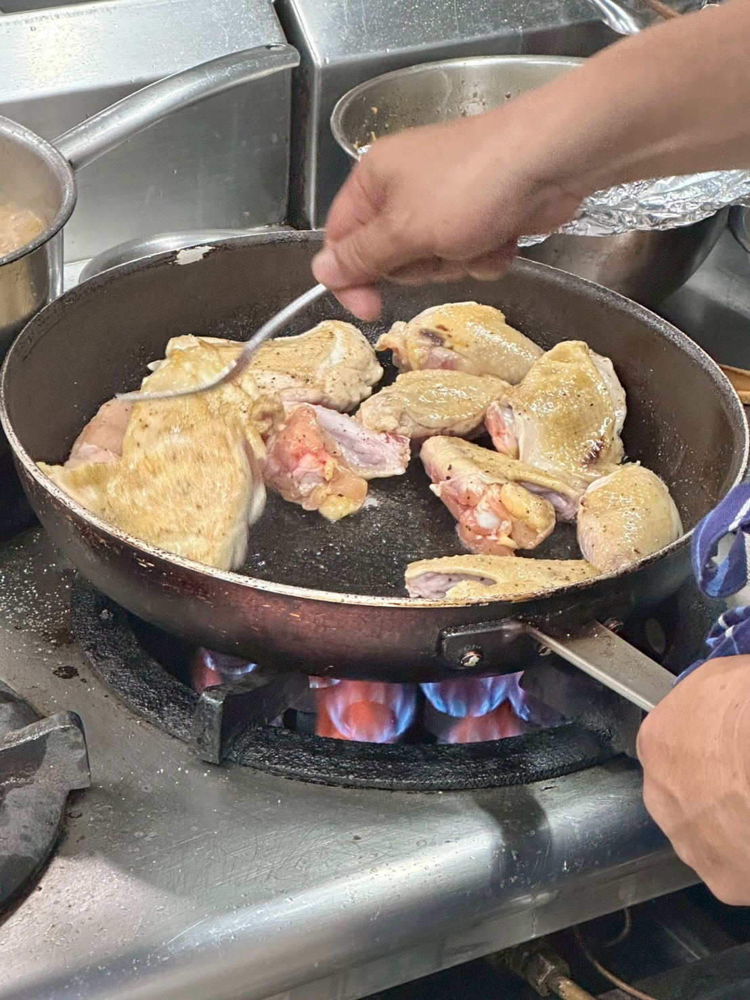
4. **翻面**：翻面後稍微上色即起鍋備用，**不需煎熟**，白醬系列比深色醬系更淺，僅求增香，勿煎至過深。

---

### 【二、醬汁製作】

#### 2-1 熬製醬汁基底

1. **煎香邊料**：鍋中放少許澄清奶油，將保留的**雞脖子、翅尖、雞架邊肉**下鍋煎，不用煎到太深顏色，取香即可。
2. **炒香蔬菜**：放入**洋蔥、西芹、紅蘿蔔、大蒜**拌炒出香氣，再加入**紅蔥頭末**炒出甜香。
3. **嗆白蘭地**：倒入白蘭地，**讓鍋面燒起火焰**（flambé）燒去酒精，此步驟增添醬汁深度香氣。
4. **加入液體**：倒入過濾好的雞高湯＋白酒＋**牛肝菌泡發水（已過濾）**。
5. **放香草束**：加入由巴西里梗 / 百里香 / 月桂葉 / 茵陳萵組成的香草束一同熬煮。
6. **熬煮收汁**：以中小火熬煮約 **40～50 分鐘**，待香味充分萃取後，用細網篩**過濾全部固體**，取得清澈醬汁底湯。

#### 2-2 完成醬汁

1. **放入牛肝菌**：將泡好的牛肝菌菇放入過濾後的底湯，加入白酒一起熬煮，讓菌菇香氣進一步融入。
    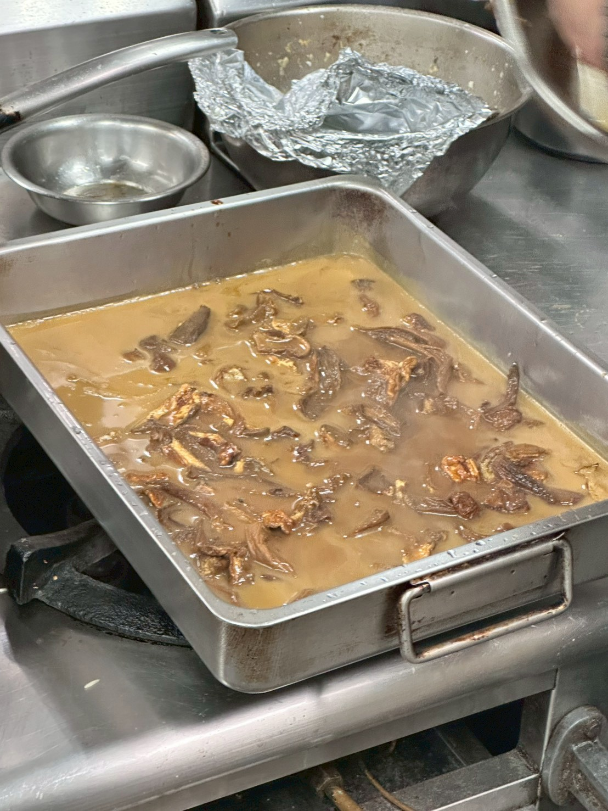
2. **加入鮮奶油**：倒入鮮奶油，以打蛋器攪拌均勻，小火保持微滾狀態。
    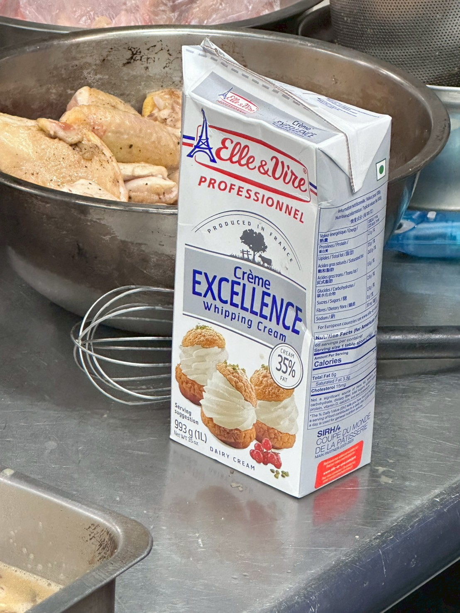
3. **勾芡**：將室溫奶油與等量麵粉混勻至**膏狀**（Beurre manié），**分次加入醬汁**中，以打蛋器持續攪勻至濃稠感合適。
    > ⚠️ **此步驟勿同時放入雞塊**，雞塊會阻礙打蛋器攪拌，導致麵糊不易化開結塊。

    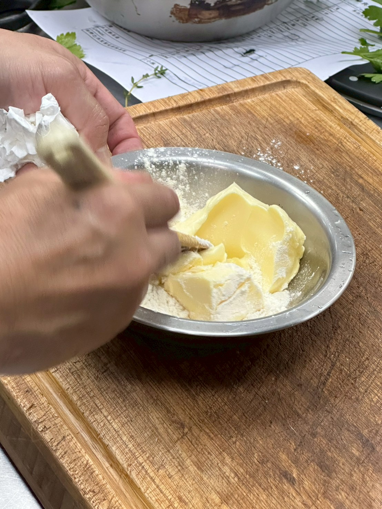
    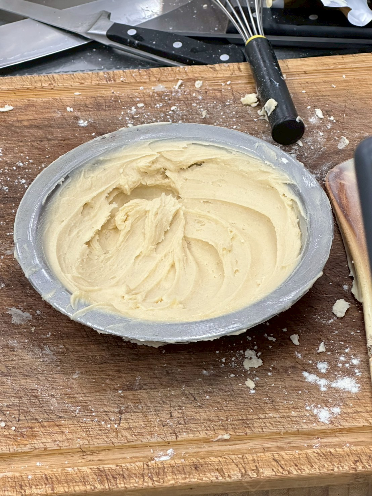
4. **試味道**：確認鹹淡，不足再加鹽調整。
5. **回鍋雞塊**：醬汁確認濃稠度與調味後，將煎好的雞塊倒入，以文火燜煮至雞肉完全熟透，約 **20～30 分鐘**。
    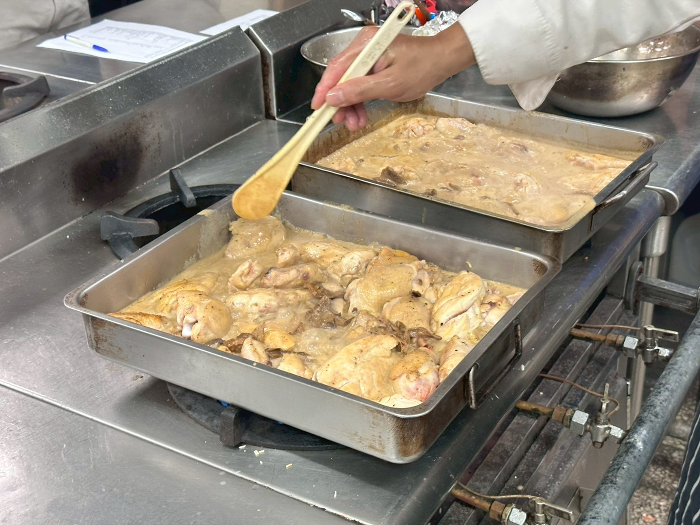
    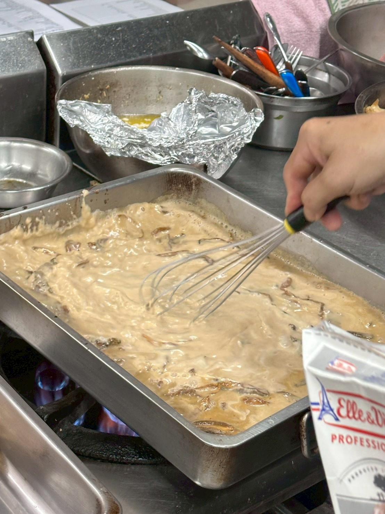
6. **過濾醬汁展示**：
    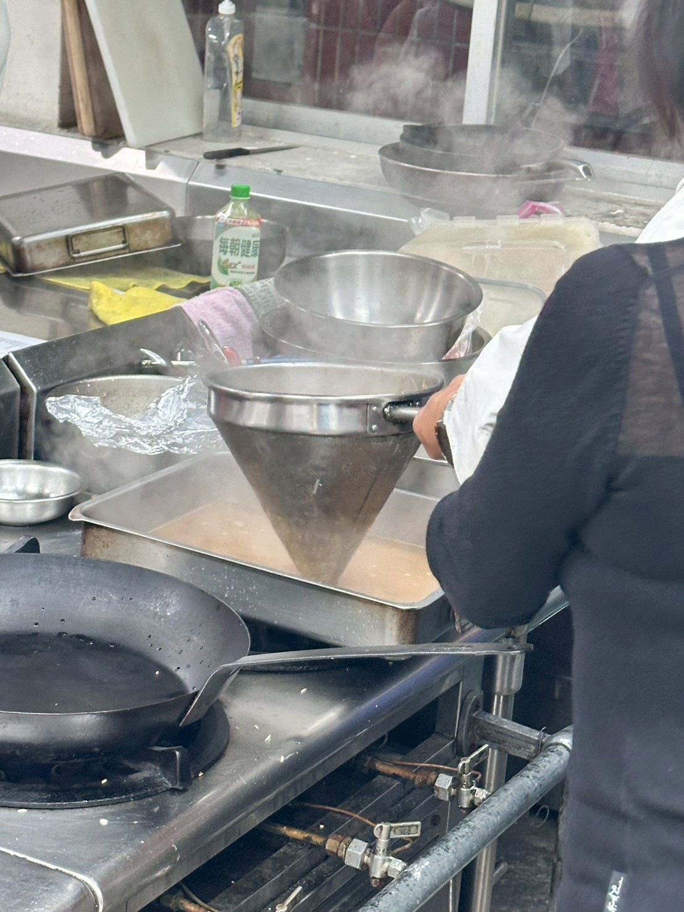

---

### 【三、炒蘑菇】

1. 蘑菇清洗後瀝乾水分，去除蒂頭。
2. 平底鍋放入澄清奶油，燒至起泡後放入蘑菇，加**少許鹽**。
3. 以大火快炒，讓蘑菇表面焦化**上色**即可起鍋，切勿翻炒過頻以免大量出水，口感變軟爛。
    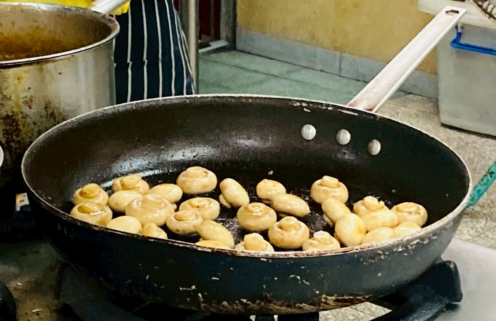

---

### 【四、披拉夫飯】

1. **洗米**：印度米清洗 2～3 遍至水變清，充分瀝乾備用。
2. **炒香底部**：鍋中放澄清奶油，放入**洋蔥末**炒香至透明。
3. **炒米**：加入瀝乾的印度米拌炒，讓每粒米均勻裹上奶油油脂。
    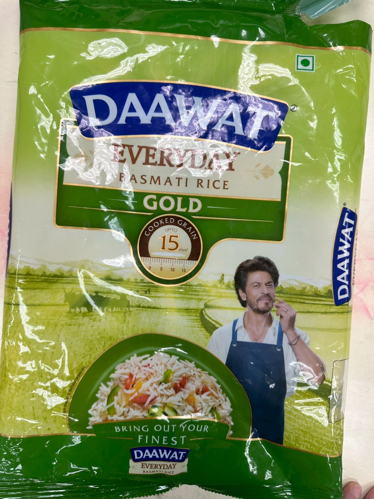
4. **加入香草束與高湯**：放入香草束（百里香 / 月桂葉 / 巴西里梗）與少許鹽拌炒，倒入熱雞高湯，煮至沸騰。
    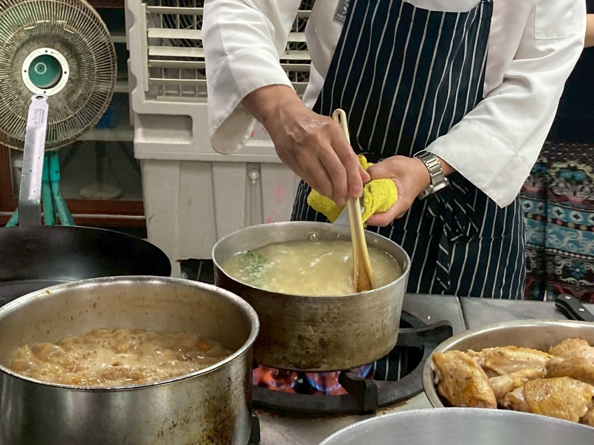
    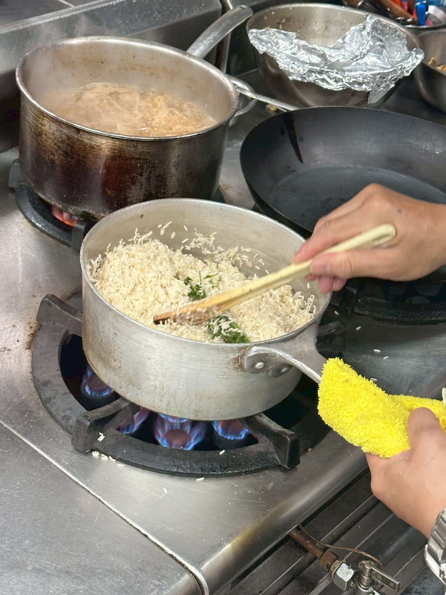
5. **封口入烤箱**：水沸後立即**離火**，以**鋁箔紙緊密封口**，放入預熱好的烤箱，**上下火 180°C，烤 20～25 分鐘**。
6. **出爐拌奶油**：取出後趁熱加入少許奶油，以叉子輕輕撥散拌勻，米粒粒粒分明、飽含奶香即完成。

---

## 💡 製作重點

1. **整雞修整**：脖子油皮、尾臊（屁股）、雞爪影響風味與口感，務必清除；翅尖雖棄用於主菜，仍可進醬汁基底取香。
2. **雙面調味**：雞塊煎製前皮面先鹽胡椒，翻面後再調味，確保兩面入味。
3. **醬汁熬基底**：邊料（脖子、雞架）不需深色煎，取香即可；加入白蘭地後一定要讓表面燒起火燄，充分去除酒精並提升香氣層次。
4. **牛肝菌泡發水是靈魂**：務必保留並過濾後加入，這是整道菜香氣的精髓所在。
5. **勾芡順序**：Beurre manié 加入時雞塊不可在鍋中，先調好濃稠度與調味，確認後再放雞塊，打蛋器才能充分攪勻。
6. **米飯封口**：高湯沸騰後立即離火封鋁箔，烤箱悶熟利用蒸氣燜滲，出爐靜置後再撥散可避免黏連粒粒分明。
7. **炒菇大火快上色**：蘑菇大火走，切勿蓋鍋悶蒸，確保焦香口感而非軟爛出水。

---

## 🍽️ 擺盤

1. 取模具內壁抹上奶油，填入披拉夫飯按壓整形。
2. **倒扣至餐盤**中央，脫模成型。
3. 擺上燴雞塊與炒蘑菇於一旁，**雞塊上淋上牛肝菌奶油醬汁**。
4. 最後點綴新鮮巴西里葉（Parsley）或龍蒿（Tarragon）枝葉，色香味俱全。

> 這是法式 Bistro 氛圍最代表性的一道主菜，醬汁的濃稠豐盈感與飯的粒粒分明形成完美對比。

