## 🍴 義式馬薩拉奶油雞附麵條 (Boneless Chicken Thighs in Marsala Mushroom Cream Sauce, served with Pasta)

### 📌 材料清單總覽

| 區塊                                                      | 材料                          | 份量   | 備註            |
| :-------------------------------------------------------- | :---------------------------- | :----- | :-------------- |
| **Chicken & Basics** (雞肉與基礎食材)               | 去骨雞腿排                    | 5 塊   |                 |
|                                                           | 無鹽奶油                      | 30g    |                 |
|                                                           | 油                            | 50ml   |                 |
|                                                           | 麵粉                          | 100g   | T55或是中筋麵粉 |
|                                                           | 百里香                        | 1 小把 |                 |
|                                                           | 鹽及胡椒                      | 少許   |                 |
| **Marsala mushroom cream sauce** (馬薩拉蘑菇奶油醬) | 大蒜                          | 30g    | 切碎            |
|                                                           | 紅蔥頭                        | 80g    | 切碎            |
|                                                           | 蘑菇                          | 300g   | 切片            |
|                                                           | 義大利馬薩拉酒 (Marsala wine) | 150ml  |                 |
|                                                           | 雞高湯                        | 500ml  |                 |
|                                                           | 鮮奶油                        | 100ml  |                 |
|                                                           | 鹽及胡椒                      | 少許   |                 |
| **To serve & Garnish** (主食與裝飾)                 | 義大利麵                      | 300g   |                 |
|                                                           | 新鮮巴西里                    | 1 小把 | 切碎            |

---

### 📝 烹飪步驟

#### 【一、備料】

1. **準備食材：** 將所有食材量秤好。
   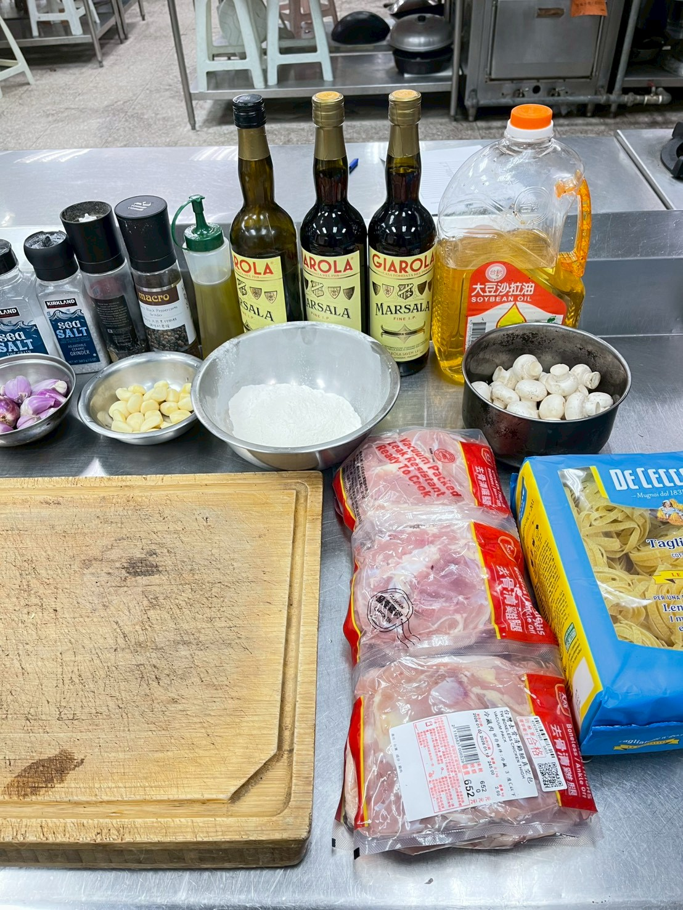
   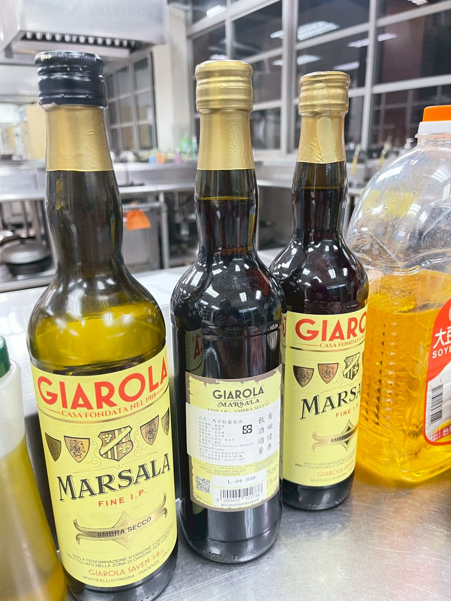
   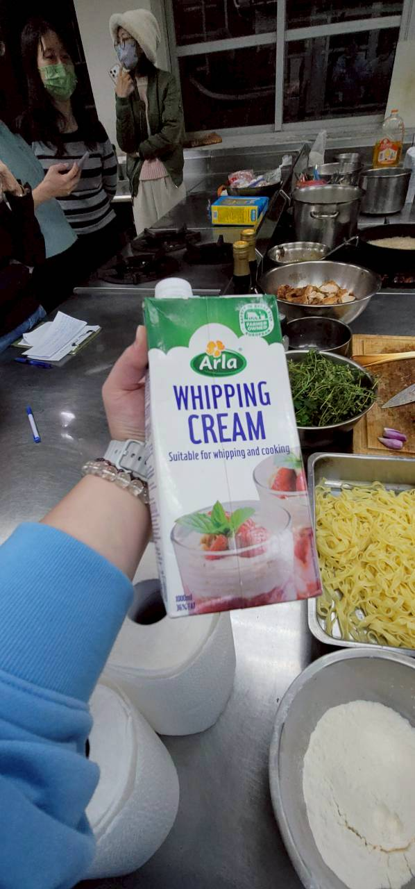
   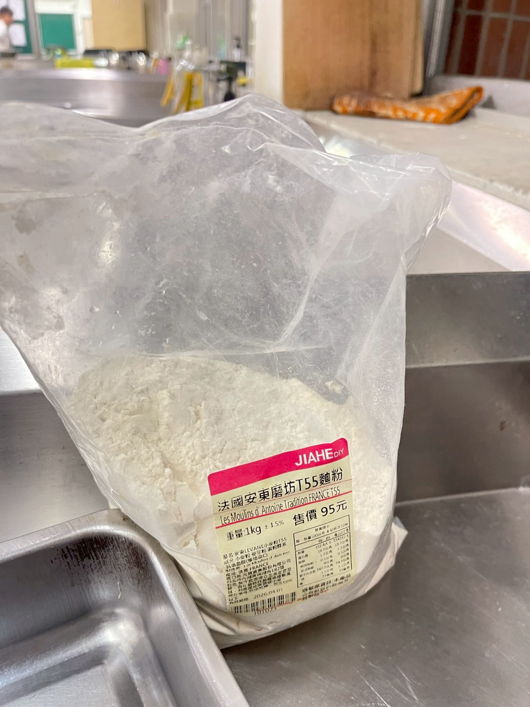
   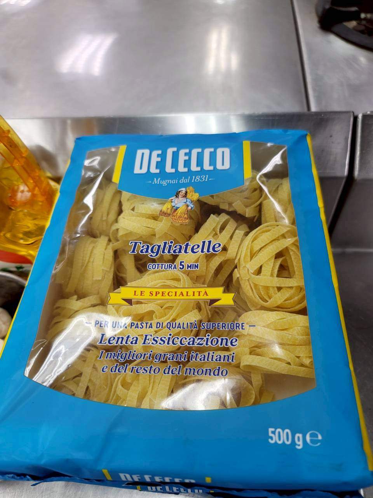
2. **切配料：**

   * 將**大蒜 30g** 與 **紅蔥頭 80g** 切碎。
     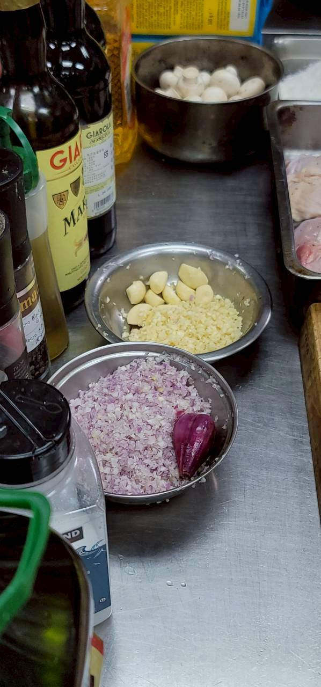
   * **蘑菇 300g** 切片備用。
     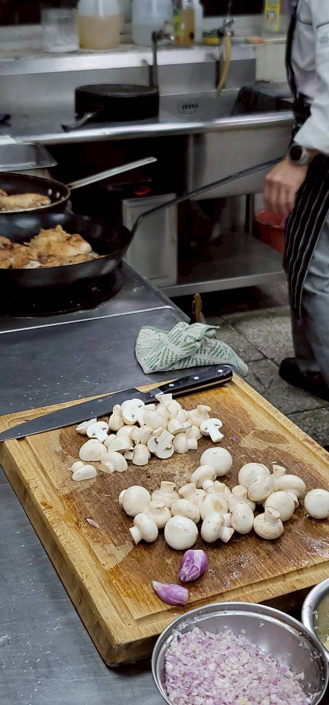

#### 【二、處理雞腿排】

1. **調味與裹粉：** 雞腿排洗淨擦乾，兩面撒上**鹽及胡椒**調味，接著均勻裹上一層薄薄的**麵粉 (100g)**。
   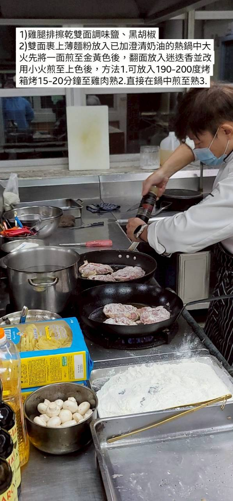
2. **煎雞排：** 熱鍋倒入 **油 50ml** 與 **無鹽奶油**，將雞皮面朝下放入鍋中，以中小火煎至金黃酥脆且熟透。
   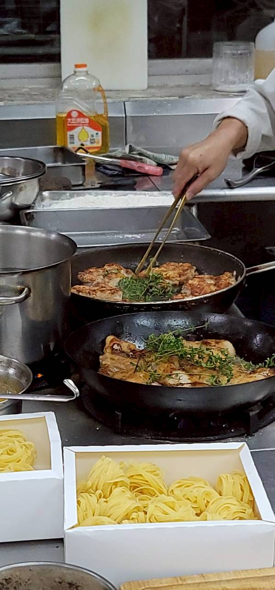
3. **靜置與切塊：** 取出煎好的雞腿排，靜置片刻後，斜切成約 3-4 塊備用。
   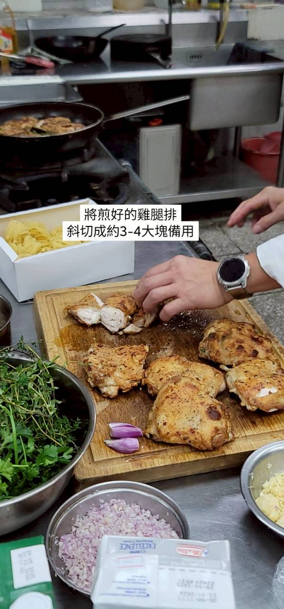

#### 【三、製作馬薩拉蘑菇奶油醬】

1. **炒香佐料：** 利用煎雞排的原鍋（保留雞油香氣），放入切片的**蘑菇**煸炒至出水且呈現褐色。
2. **加入辛香料：** 加入切碎的**紅蔥頭**與**大蒜**，炒出香氣。
   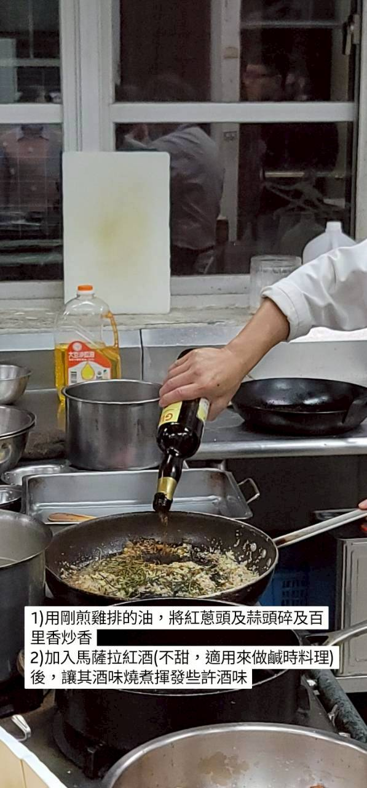
3. **嗆酒與燉煮：**
   * 倒入 **義大利馬薩拉酒 150ml**，刮起鍋底的焦香物質 (Deglaze)，煮至酒精揮發且醬汁濃縮約一半。
   * 加入 **雞高湯 500ml** 與 **百里香**，繼續熬煮至湯汁收乾至適當濃度。
     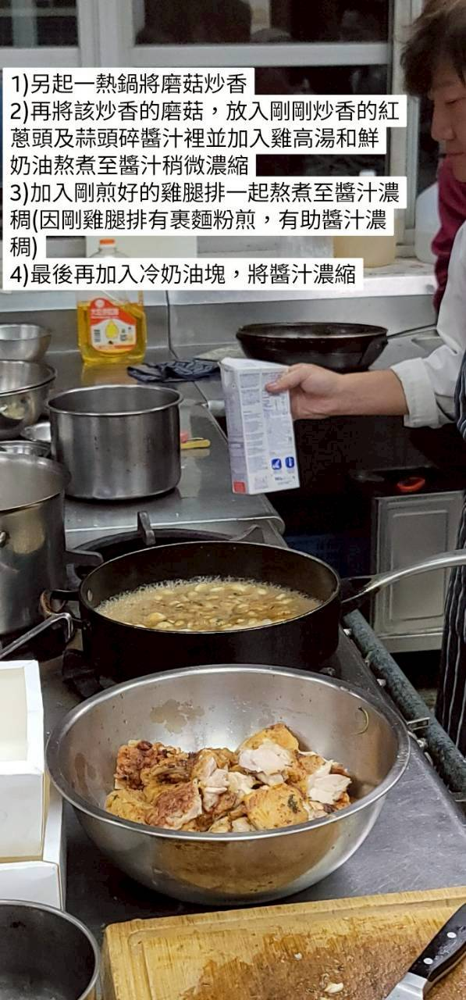
4. **加入鮮奶油：** 倒入 **鮮奶油 100ml**，轉小火攪拌均勻，煮至醬汁濃稠滑順。最後以**鹽及胡椒**調整味道。
   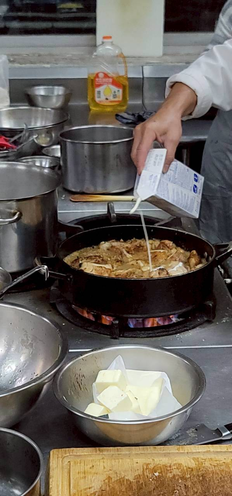

#### 【四、煮義大利麵】

1. 準備一鍋滾水，加入足量的鹽。
2. 放入 **義大利麵 300g**，按照包裝指示時間煮至彈牙 (Al dente)。
3. 撈起瀝乾，拌入少許橄欖油防止沾黏。
   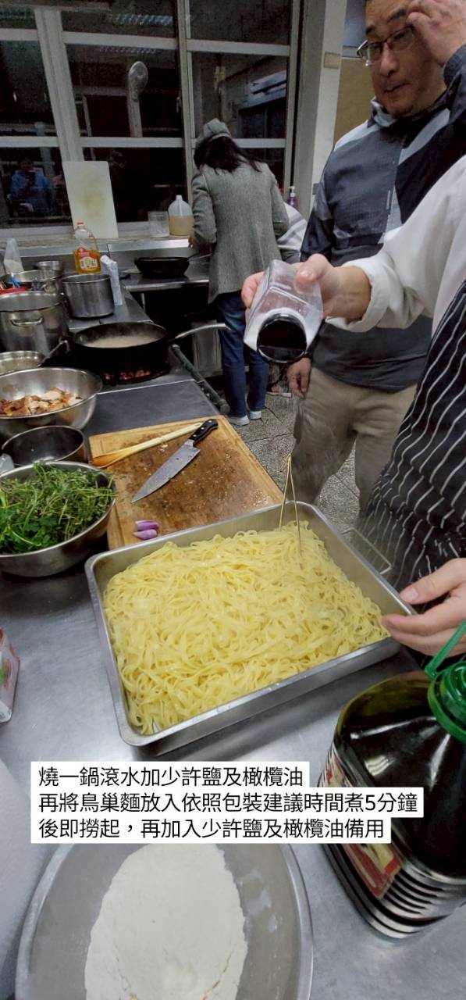

#### 【五、組裝與擺盤】

1. **盛盤：** 夾取適量義大利麵於盤中捲高。
   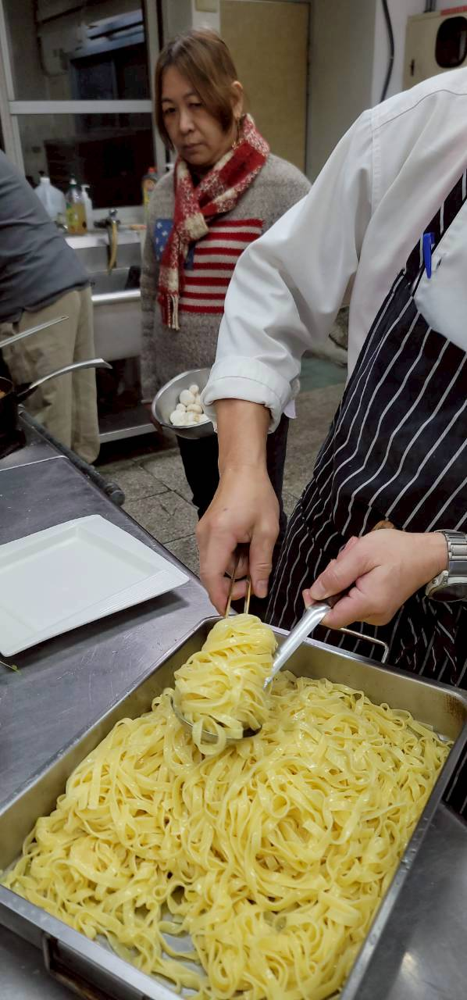
2. **擺放雞肉：** 將切好的雞腿排倚靠在義大利麵旁。
   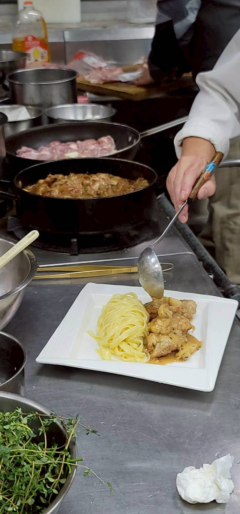
3. **淋醬與裝飾：** 淋上濃郁的馬薩拉蘑菇奶油醬，最後撒上切碎的**新鮮巴西里**裝飾即完成。
   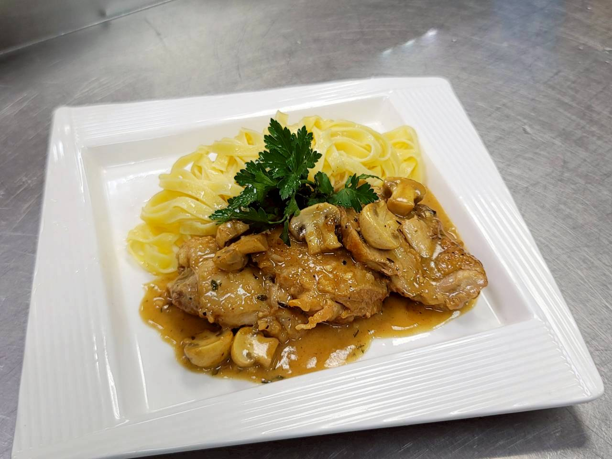
